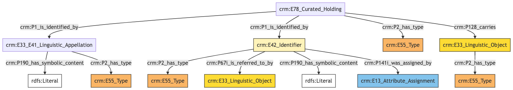
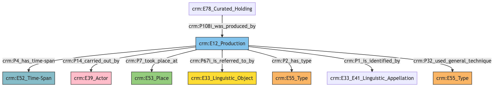
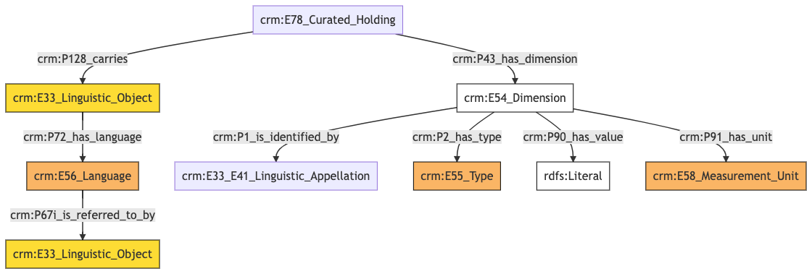
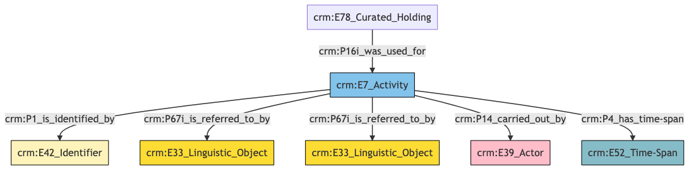
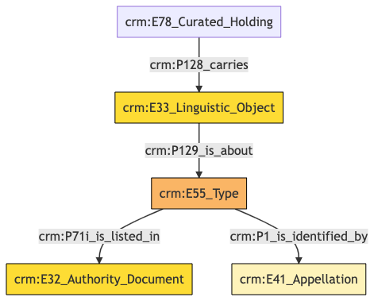
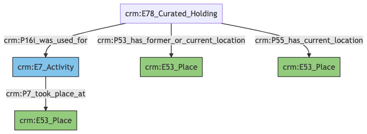
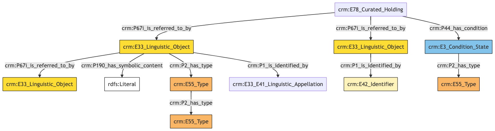
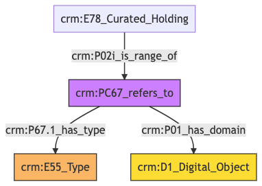

##**Archival Resource**##

**Author:** Denitsa Nenova, George Bruseker

**Version:** 1.0

The *Archival Resource* model is meant to provide a semantic data representation of fields typically used in the documentation of archival records. The generation of archival records typically entails the documentation of a physical and intellectual organization of a collection of holdings. The *Archival Resource* model provides a semantic construct for representing these levels in the CIDOC CRM. An instance of *Archival Resource* is meant to be equivalent to a categorical level of documentation in archival data structures such as collection, series, sub-series, etc. It is meant to be used to document collections of items organized physical and intellectualy in a hierarchy from Collection downward. It is agnostic to the number of levels or particular means of determining the distribution of levels. 


| | Name| URI | 
|-|-----|-----|
|Root Ontology Node|E78 Curated Holding | https://cidoc-crm.org/Entity/E78-Curated-Holding/version-7.1.1|
|Type Differentiator |archives (groupings) | http://vocab.getty.edu/aat/300375748 |

The document model allows the documentation of the following kinds of information:

|Information Category | Information Collections | Description | 
|---------------------|-------------------------|-------------|
| Names and Classifications |   Names/Identifiers/Type  |  The researcher can document various names and classification regarding the *Archival Resource*.|
|Existence   | Production and Creation|   The researcher can document the events related to the production of an *Archival Resource*.|
|Substance   | Dimension | The researcher can document various physical information about the *Archival Resource*.|
|Actor Relations | Activity Actor/Curator | The researcher can document variuos relationships between the *Archival Resource* and an actor.|
|Aboutness  | Subject |   The researcher can document a variety of subject information embedded in the content of the *Archival Resource* .|
|Location   | Location   | The researcher can document the location of the *Archival Resource*.|
|Description  |  Description/Condition |   The researcher can document various free-text descriptions about the appearance or the condition of the *Archival Resource*.|
|Documentation  |  Digital Reference | The researcher can document digital objects such as images relative to the *Archival Resource* |

## Archival Resource **Names and Classifications**

The attribution of names and types to an *Archival Resource*, as with other entities, is a basic human activity. A chief factor in disambiguating objects lies in understanding the various names and identifiers that have been given to them at different moments in their individual histories. Likewise, additional classifiers of the *Archival Resource* give important distinguishing characteristics.

| Filed ID    | Name                          | Description | Data Type | CRM Path |
| ----------- | ------------------------------|-------------|-----------|----------|
|PMAF.1   | Level of Description |   This field is used to record the level of description (type) attributed the documented *Archival Resource*. |   Concept  |  ->P128->E33[A1_1]->P2->E55 "Archival Level"[A1_2]|
|LAF.10   | Archival Part ID   | This field is used to record an identifier attributed to the documented *Archival Resource*.  |  String  |  ->p1->E42[8_1]->p190->rdf:literal|
|LAF.6  |  Unit Title  |  This field is used to record the string value of the name attributed to the documented *Archival Resource*. |   String  |  ->p1->E33_E41[4_1]->p190->rdf:literal|
|LAF.5  |  Unit Title Type  |  This field is used to record the type of the name attributed to the documented *Archival Resource*. |   Concept   | ->p1->E33_41[4_1]->p2->E55[5_1]|
|LAF.4  |  Unit Title Label |   This field is used to record the string value of the machine readable label used for displaying the instance of name that is used to denote the documented *Archival Resource*. |   String   | ->p1->E33_41[4_1]->rdfs:label->rdf:literal|
|LAF.10  |  ID  |  This field is used to record an identifier attributed to the documented *Archival Resource*.  |  String  |  ->p1->E42[8_1]->p190->rdf:literal|
|LAF.9   | ID Type |   This field is used to record the type of the identifier attributed to the documented c*Archival Resource*.  |  Concept   | ->p1->E42[8_1]->p2->E55[9_1]|
|LAF.45  |  ID Source  |  This field is used to link to a source text in which the identifier denoting the documented *Archival Resource* is used.  |  Reference Model [Textual Work]|  ->p1->E42[8_1]->p67i->E33[45_1]|
|LAF.434  |  Identifier Attributed By  |  This field is used to indicate the details of the data assignment of this identifier to the documented *Archival Resource*.  |  Collection  [Data Assignment] | ->p1->E42[8_1]->p141i->E13[434_1]|
|LAF.11   | Term  |  This field is used to record the formal type of the documented *Archival Resource*g. |   Concept |   ->p2->E55[11_1]|

### - Archival Resource Names and Classifications **Ontology Graph**



### - Archival Resource Names and Classifications **RDF**

```
@prefix crm: <http://www.cidoc-crm.org/cidoc-crm/> .
@prefix rdfs: <http://www.w3.org/2000/01/rdf-schema#> .

<https://pma.us/models/archival_unit/E78> a crm:E78_Curated_Holding ;
    crm:P128_carries <https://pma.us/conceptual_object/A1_1> ;
    crm:P1_is_identified_by <https://linked.art/example/conceptual_object/4_1>,
        <https://linked.art/example/conceptual_object/8_1> ;
    crm:P2_has_type <https://linked.art/example/type/11_1> .

<http://vocab.getty.edu/page/aat/300404670> a crm:E55_Type ;
    rdfs:label "preferred terms" .

<https://linked.art/example/conceptual_object/4_1> a crm:E33_E41_Linguistic_Appellation ;
    rdfs:label "Name_label_value" ;
    crm:P190_has_symbolic_content "Name_string_value" ;
    crm:P2_has_type <http://vocab.getty.edu/page/aat/300404670> .

<https://linked.art/example/conceptual_object/8_1> a crm:E42_Identifier ;
    crm:P141i_was_assigned_by <https://linked.art/example/event/434_1> ;
    crm:P190_has_symbolic_content "Identifier_value_content" ;
    crm:P2_has_type <https://linked.art/example/identifier/9_1> ;
    crm:P67i_is_referred_to_by <https://linked.art/example/textual_object/45_1> .

<https://linked.art/example/event/434_1> a crm:E13_Attribute_Assignment .

<https://linked.art/example/identifier/9_1> a crm:E55_Type .

<https://linked.art/example/textual_object/45_1> a crm:E33_Linguistic_Object .

<https://linked.art/example/type/11_1> a crm:E55_Type .

<https://pma.us/conceptual_object/A1_1> a crm:E33_Linguistic_Object ;
    crm:P2_has_type <https://pma.us/type/A1_2> .

<https://pma.us/type/A1_2> a crm:E55_Type .


                
```

### - Archival Resource Names and Classifications **JSON-LD**

```
{
  "@context": "https://linked.art/ns/v1/linked-art.json",
  "@graph": [
    {
      "id": "https://linked.art/example/type/11_1",
      "type": "Type"
    },
    {
      "id": "https://pma.us/type/A1_2",
      "type": "Type"
    },
    {
      "id": "https://linked.art/example/event/434_1",
      "type": "AttributeAssignment"
    },
    {
      "_label": "Name_label_value",
      "classified_as": [
        "http://vocab.getty.edu/page/aat/300404670"
      ],
      "content": "Name_string_value",
      "id": "https://linked.art/example/conceptual_object/4_1",
      "type": "Name"
    },
    {
      "_label": "preferred terms",
      "id": "http://vocab.getty.edu/page/aat/300404670",
      "type": "Type"
    },
    {
      "classified_as": [
        "https://pma.us/type/A1_2"
      ],
      "id": "https://pma.us/conceptual_object/A1_1",
      "type": "LinguisticObject"
    },
    {
      "id": "https://linked.art/example/textual_object/45_1",
      "type": "LinguisticObject"
    },
    {
      "id": "https://linked.art/example/identifier/9_1",
      "type": "Type"
    },
    {
      "carries": [
        "https://pma.us/conceptual_object/A1_1"
      ],
      "classified_as": [
        "https://linked.art/example/type/11_1"
      ],
      "id": "https://pma.us/models/archival_unit/E78",
      "identified_by": [
        "https://linked.art/example/conceptual_object/4_1",
        "https://linked.art/example/conceptual_object/8_1"
      ],
      "type": "CuratedHolding"
    },
    {
      "assigned_by": [
        "https://linked.art/example/event/434_1"
      ],
      "classified_as": [
        "https://linked.art/example/identifier/9_1"
      ],
      "content": "Identifier_value_content",
      "id": "https://linked.art/example/conceptual_object/8_1",
      "referred_to_by": [
        "https://linked.art/example/textual_object/45_1"
      ],
      "type": "Identifier"
    }
  ]
}
                
```

## Archival Resource **Existence**

Of essential import in identifying and tracking *Archival Resources* is information pertaining to their existence in time, particularly information regarding the production of the resource.

| Filed ID    | Name                          | Description | Data Type | CRM Path |
| ----------- | ------------------------------|-------------|-----------|----------|
|LAF.300 |   Production Name |   This field is used to link the documented production activity of the *Archival Resource* to a name that has been attributed to it.  |  Collection [Name] |   ->P108i->E12[295_1]->P1->E33_E41[300_1]|
|LAF.302  |  Production Date  |  This field is used to link the documented production activity  of the *Archival Resource* to an instance of time-span recording the temporal extent of the activity. |   Collection [Timespan]|   ->P108i->E12[295_1]->P4->E52[302_1]|
|LAF.298  |  Creator  |  This field is used to link the documented production activity  of the *Archival Resource* to an actor responsible for carrying it out.  |  Reference Model [Person/Group] |  ->P108i->E12[295_1]->P14->E39[298_1]|
|LAF.295 |   Creation Place  |  This field is used to link the documented production activity of the *Archival Resource* to a location at which it was carried out.  |  Reference Model  [Place] |  ->P108i->E12[295_1]->P7->E53[295_2]|
|LAF.297 |   Creator Source  |  This field is used to link the documented production activity of the *Archival Resource* to a textual source which documents the activity itself. |   Reference Model [Textual Work]|   ->P108i->E12[295_1]->P67i->E33[297_1]|
|LAF.305 |   Creation Technique  |  This field is used to indicate a kind of technique used in the execution of the documented production activity of the *Archival Resource*.  |  Concept  |  ->P108i->E12[295_1]->P32->E55[305_1]|
|LAF.303 |   Creation Type |   This field is used to record the formal type of the documented production activity of the *Archival Resource*.   | Concept  |  ->P108i->E12[295_1]->P2->E55[303_1]|

### - Archival Resource Existence **Ontology Graph**



### - Archival Resource Existence **RDF**

```
@prefix crm: <http://www.cidoc-crm.org/cidoc-crm/> .

<https://pma.us/models/archival_unit/E78> a crm:E78_Curated_Holding ;
    crm:P108i_was_produced_by <https://linked.art/example/event/295_1> .

<https://linked.art/example/actor/298_1> a crm:E39_Actor .

<https://linked.art/example/conceptual_object/297_1> a crm:E33_Linguistic_Object .

<https://linked.art/example/event/295_1> a crm:E12_Production ;
    crm:P14_carried_out_by <https://linked.art/example/actor/298_1> ;
    crm:P1_is_identified_by <https://linked.art/example/name/300_1> ;
    crm:P2_has_type <https://linked.art/example/type/303_1> ;
    crm:P32_used_general_technique <https://linked.art/example/type/305_1> ;
    crm:P4_has_time-span <https://linked.art/example/time_span/302_1> ;
    crm:P67i_is_referred_to_by <https://linked.art/example/conceptual_object/297_1> ;
    crm:P7_took_place_at <https://linked.art/example/place/295_2> .

<https://linked.art/example/name/300_1> a crm:E33_E41_Linguistic_Appellation .

<https://linked.art/example/place/295_2> a crm:E53_Place .

<https://linked.art/example/time_span/302_1> a crm:E52_Time-Span .

<https://linked.art/example/type/303_1> a crm:E55_Type .

<https://linked.art/example/type/305_1> a crm:E55_Type .


                

```

### - Archival Resource Existence **JSON-LD**

```
{
  "@context": "https://linked.art/ns/v1/linked-art.json",
  "@graph": [
    {
      "id": "https://linked.art/example/type/303_1",
      "type": "Type"
    },
    {
      "id": "https://linked.art/example/time_span/302_1",
      "type": "TimeSpan"
    },
    {
      "id": "https://linked.art/example/place/295_2",
      "type": "Place"
    },
    {
      "id": "https://linked.art/example/name/300_1",
      "type": "Name"
    },
    {
      "id": "https://linked.art/example/conceptual_object/297_1",
      "type": "LinguisticObject"
    },
    {
      "id": "https://linked.art/example/type/305_1",
      "type": "Type"
    },
    {
      "id": "https://pma.us/models/archival_unit/E78",
      "produced_by": "https://linked.art/example/event/295_1",
      "type": "CuratedHolding"
    },
    {
      "carried_out_by": [
        "https://linked.art/example/actor/298_1"
      ],
      "classified_as": [
        "https://linked.art/example/type/303_1"
      ],
      "id": "https://linked.art/example/event/295_1",
      "identified_by": [
        "https://linked.art/example/name/300_1"
      ],
      "referred_to_by": [
        "https://linked.art/example/conceptual_object/297_1"
      ],
      "technique": [
        "https://linked.art/example/type/305_1"
      ],
      "timespan": "https://linked.art/example/time_span/302_1",
      "took_place_at": [
        "https://linked.art/example/place/295_2"
      ],
      "type": "Production"
    },
    {
      "id": "https://linked.art/example/actor/298_1",
      "type": "Actor"
    }
  ]
}
                

```

## Archival Resource **Substance**

The analysis and understanding of an *Archival Resource* depends also on our knowledge of its materiality and physical characteristics. The category of substance brings together descriptors which are relevant to this form of analysis. Particularly, it groups information having to do with the composition and measurable aspects or the languange of the content of the *Archival Resource*.

| Filed ID    | Name                          | Description | Data Type | CRM Path |
| ----------- | ------------------------------|-------------|-----------|----------|
| LAF.100  |   Dimension Name |    This field is used to link the documented dimension of the documented *Archival Resource* to a name that has been attributed to it.   |  Collection  [Name] |  ->p43->E54[98_1]->p1->E33_41[100_1]| 
| LAF.99  |   Dimension Unit |    This field is used to record the unit for the instance of dimension of the documented *Archival Resource*.  |   Concept   |  ->p43->E54[98_1]->p91->E58[99_1]| 
| LAF.101 |    Dimension Value |    This field is used to record the value for the instance of dimension of the documented *Archival Resource*.  |   Integer   |  ->p43->E54[98_1]->p90->rdf:literal| 
| LAF.104  |   Dimension Type  |   This field is used to record the formal type of the dimension of the documented *Archival Resource*.  |   Concept |   ->p43->E54[98_1]->p2->E55[104_1]
| PMAF.2  |   Language |    This field is used to record the language attributed to the content of the documented *Archival Resource*.  |   Concept   |  ->P128->E33[A1_1]->P72->E56[A2_1]| 
| PMAF.4  |   Language Statement  |   This field is used to record a statement made about the language attributed to the content of the documented *Archival Resource*.|     Collection [Statement]|    ->P128->E33[A1_1]->P72->E56[A2_1]->P67i->E33[A4_1]| 

### - Archival Resource Substance **Ontology Graph**



### - Archival Resource Substance **RDF**

```
@prefix crm: <http://www.cidoc-crm.org/cidoc-crm/> .

<https://pma.us/models/archival_unit/E78> a crm:E78_Curated_Holding ;
    crm:P128_carries <https://pma.us/conceptual_object/A1_1> ;
    crm:P43_has_dimension <https://linked.art/example/dimension/98_1> .

<https://linked.art/example/dimension/98_1> a crm:E54_Dimension ;
    crm:P1_is_identified_by <https://linked.art/example/name/100_1> ;
    crm:P2_has_type <https://linked.art/example/type/104_1> ;
    crm:P90_has_value "integer" ;
    crm:P91_has_unit <https://linked.art/example/type/99_1> .

<https://linked.art/example/name/100_1> a crm:E33_E41_Linguistic_Appellation .

<https://linked.art/example/type/104_1> a crm:E55_Type .

<https://linked.art/example/type/99_1> a crm:E58_Measurement_Unit .

<https://pma.us/conceptual_object/A1_1> a crm:E33_Linguistic_Object ;
    crm:P72_has_language <https://pma.us/type/A2_1> .

<https://pma.us/conceptual_object/A4_1> a crm:E33_Linguistic_Object .

<https://pma.us/type/A2_1> a crm:E56_Language ;
    crm:P67i_is_referred_to_by <https://pma.us/conceptual_object/A4_1> .


                
```

### - Archival Resource Substance **JSON-LD**

```
{
  "@context": "https://linked.art/ns/v1/linked-art.json",
  "@graph": [
    {
      "id": "https://linked.art/example/name/100_1",
      "type": "Name"
    },
    {
      "classified_as": [
        "https://linked.art/example/type/104_1"
      ],
      "id": "https://linked.art/example/dimension/98_1",
      "identified_by": [
        "https://linked.art/example/name/100_1"
      ],
      "type": "Dimension",
      "unit": "https://linked.art/example/type/99_1",
      "value": "integer"
    },
    {
      "id": "https://linked.art/example/type/104_1",
      "type": "Type"
    },
    {
      "id": "https://linked.art/example/type/99_1",
      "type": "MeasurementUnit"
    },
    {
      "id": "https://pma.us/conceptual_object/A1_1",
      "language": [
        "https://pma.us/type/A2_1"
      ],
      "type": "LinguisticObject"
    },
    {
      "id": "https://pma.us/type/A2_1",
      "referred_to_by": [
        "https://pma.us/conceptual_object/A4_1"
      ],
      "type": "Language"
    },
    {
      "carries": [
        "https://pma.us/conceptual_object/A1_1"
      ],
      "dimension": [
        "https://linked.art/example/dimension/98_1"
      ],
      "id": "https://pma.us/models/archival_unit/E78",
      "type": "CuratedHolding"
    },
    {
      "id": "https://pma.us/conceptual_object/A4_1",
      "type": "LinguisticObject"
    }
  ]
}
                
```


## Archival Resource **Actor Relations**

The connection between an *Archival Resource* and different actors such as curators provides another important set of descriptors for identifying and tracing the *Archival Resource*.

| Filed ID    | Name                          | Description | Data Type | CRM Path |
| ----------- | ------------------------------|-------------|-----------|----------|
|LAF.61  |  Curated By  |  This field is used to link the documented curated holding curation activity to an actor responsible for carrying it out.   | Reference Model [Person/Group]  | ->P16i->E7[58_1]->P14->E39[61_1]|
|LAF.69 |   Curation ID  |  This field is used to link the documented curated holding curation activity to an identifier that has been attributed to it.  |  Collection  [Identifier] | ->P16i->E7[58_1]->P1->E42[69_1]|
|LAF.70  |  Curation Statement |   This field is used to link the documented curated holding curation activity to a statement that describes it.  |  Collection [Statement]|   ->P16i->E7[58_1]->P67i->E33[70_1]|
|LAF.60  |  Curation Source  |  This field is used to link the documented curated holding curation activity to a textual source which documents the curation itself. |   Reference Model [Textual Work] |  ->P16i->E7[58_1]->P67i->E33[60_1]|
|LAF.65  |  Curation Period |   This field is used to link the documented curated holding curation activity to an instance of time-span recording the temporal extent of the activity. |   Collection [Timespan]  |  ->P16i->E7[58_1]->P4->E52[65_1]|

### - Archival Resource Actor Relations **Ontology Graph**



### - Archival Resource Actor Relations **RDF**

```
@prefix crm: <http://www.cidoc-crm.org/cidoc-crm/> .

<https://pma.us/models/archival_unit/E78> a crm:E78_Curated_Holding ;
    crm:P16i_was_used_for <https://linked.art/example/event/58_1> .

<https://linked.art/example/actor/61_1> a crm:E39_Actor .

<https://linked.art/example/conceptual_object/60_1> a crm:E33_Linguistic_Object .

<https://linked.art/example/conceptual_object/70_1> a crm:E33_Linguistic_Object .

<https://linked.art/example/event/58_1> a crm:E7_Activity ;
    crm:P14_carried_out_by <https://linked.art/example/actor/61_1> ;
    crm:P1_is_identified_by <https://linked.art/example/identifier/69_1> ;
    crm:P4_has_time-span <https://linked.art/example/time_span/65_1> ;
    crm:P67i_is_referred_to_by <https://linked.art/example/conceptual_object/60_1>,
        <https://linked.art/example/conceptual_object/70_1> .

<https://linked.art/example/identifier/69_1> a crm:E42_Identifier .

<https://linked.art/example/time_span/65_1> a crm:E52_Time-Span .


                
```


### - Archival Resource Actor Relations **JSON-LD**

```
{
  "@context": "https://linked.art/ns/v1/linked-art.json",
  "@graph": [
    {
      "id": "https://linked.art/example/conceptual_object/60_1",
      "type": "LinguisticObject"
    },
    {
      "id": "https://linked.art/example/time_span/65_1",
      "type": "TimeSpan"
    },
    {
      "id": "https://linked.art/example/conceptual_object/70_1",
      "type": "LinguisticObject"
    },
    {
      "id": "https://linked.art/example/identifier/69_1",
      "type": "Identifier"
    },
    {
      "carried_out_by": [
        "https://linked.art/example/actor/61_1"
      ],
      "id": "https://linked.art/example/event/58_1",
      "identified_by": [
        "https://linked.art/example/identifier/69_1"
      ],
      "referred_to_by": [
        "https://linked.art/example/conceptual_object/60_1",
        "https://linked.art/example/conceptual_object/70_1"
      ],
      "timespan": "https://linked.art/example/time_span/65_1",
      "type": "Activity"
    },
    {
      "id": "https://pma.us/models/archival_unit/E78",
      "type": "CuratedHolding",
      "used_for": [
        "https://linked.art/example/event/58_1"
      ]
    },
    {
      "id": "https://linked.art/example/actor/61_1",
      "type": "Actor"
    }
  ]
}
                
```


## Archival Resource **Aboutness**

The use of an *Archival Resource* to the researcher lies in its role as an information carrier which bears a certain information object which can be consulted in order to get evidence with regards to some phenomena in the past or present. Thus the representative aspect of the *Archival Resource* is of prime documentary concern. In this category there is a categorization of the pertinence of the information object with regards to major real world referents.

| Filed ID    | Name                          | Description | Data Type | CRM Path |
| ----------- | ------------------------------|-------------|-----------|----------|
|PMAF.12   | Subject |   This field is used to record the generic subject of the content of the documented *Archival Resource*.  |  String   | ->P128->E33[A1_1]->P129->E55[A12_2]|
|PMAF.13  |  Subject Source  |  This field is used to record the source attributing the generic subject of the content of the documented *Archival Resource*.  |  URL  |  ->P128->E33[A1_1]->P129->E55[A12_2]->P71i->E32[A13_1]|
|PMAF.14  |  Subject Name |   This field is used to record the name given to the generic subject of the content of the documented *Archival Resource*.   | String  |  ->P128->E33[A1_1]->P129->E55[A12_2]->P1->E41[A14_1]|

### - Archival Resource Aboutness **Ontology Graph**



### - Archival Resource Aboutness **RDF**

```
@prefix crm: <http://www.cidoc-crm.org/cidoc-crm/> .

<https://pma.us/models/archival_unit/E78> a crm:E78_Curated_Holding ;
    crm:P128_carries <https://pma.us/conceptual_object/A1_1> .

<https://pma.us/appellation/A14_1> a crm:E41_Appellation .

<https://pma.us/conceptual_object/A13_1> a crm:E32_Authority_Document .

<https://pma.us/conceptual_object/A1_1> a crm:E33_Linguistic_Object ;
    crm:P129_is_about <https://pma.us/type/A12_1> .

<https://pma.us/type/A12_1> a crm:E55_Type ;
    crm:P1_is_identified_by <https://pma.us/appellation/A14_1> ;
    crm:P71i_is_listed_in <https://pma.us/conceptual_object/A13_1> .


                
```

### - Archival Resource Aboutness **JSON-LD**

```
{
  "@context": "https://linked.art/ns/v1/linked-art.json",
  "@graph": [
    {
      "id": "https://pma.us/appellation/A14_1",
      "type": "Appellation"
    },
    {
      "id": "https://pma.us/type/A12_1",
      "identified_by": [
        "https://pma.us/appellation/A14_1"
      ],
      "listed_in": [
        "https://pma.us/conceptual_object/A13_1"
      ],
      "type": "Type"
    },
    {
      "about": [
        "https://pma.us/type/A12_1"
      ],
      "id": "https://pma.us/conceptual_object/A1_1",
      "type": "LinguisticObject"
    },
    {
      "carries": [
        "https://pma.us/conceptual_object/A1_1"
      ],
      "id": "https://pma.us/models/archival_unit/E78",
      "type": "CuratedHolding"
    },
    {
      "id": "https://pma.us/conceptual_object/A13_1",
      "type": "AuthorityDocument"
    }
  ]
}
                
```

## Archival Resource **Location**

The documentation of location aids in tracking the present location of the archival resources as well as their dispersion geographically. This information category gathers together relevant descriptors for this task.


| Filed ID    | Name                          | Description | Data Type | CRM Path |
| ----------- | ------------------------------|-------------|-----------|----------|
|LAF.58   | Current Location  |  This field is used to link the documented *Archival Resource* curation activity to a location at which it was carried out.   | Reference Model [Place] |  ->P16i->E7[58_1]->P7->E53[58_2]
|LAF.247  |  Repository  |This field is used to link the documented *Archival Resource* with the instance of place that stands as its permanent location.|Reference Model [Place] |  ->p55->E53[247_1]|
|PMAF.9   | Container  |  This field is used to record the internal location of the documented *Archival Resource*g.  |  Reference Model  [Place]  | ->P53->E53[A9_1]|

### - Archival Resource Location **Ontology Graph**



### - Archival Resource Location **RDF**

```
@prefix crm: <http://www.cidoc-crm.org/cidoc-crm/> .

<https://pma.us/models/archival_unit/E78> a crm:E78_Curated_Holding ;
    crm:P16i_was_used_for <https://linked.art/example/event/58_1> ;
    crm:P53_has_former_or_current_location <https://pma.us/place/A9_1> ;
    crm:P55_has_current_location <https://linked.art/example/place/247_1> .

<https://linked.art/example/event/58_1> a crm:E7_Activity ;
    crm:P7_took_place_at <https://linked.art/example/place/58_2> .

<https://linked.art/example/place/247_1> a crm:E53_Place .

<https://linked.art/example/place/58_2> a crm:E53_Place .

<https://pma.us/place/A9_1> a crm:E53_Place .


                
```

### - Archival Resource Location **JSON-LD**

```
{
  "@context": "https://linked.art/ns/v1/linked-art.json",
  "@graph": [
    {
      "id": "https://linked.art/example/place/247_1",
      "type": "Place"
    },
    {
      "id": "https://pma.us/place/A9_1",
      "type": "Place"
    },
    {
      "id": "https://linked.art/example/place/58_2",
      "type": "Place"
    },
    {
      "id": "https://linked.art/example/event/58_1",
      "took_place_at": [
        "https://linked.art/example/place/58_2"
      ],
      "type": "Activity"
    },
    {
      "current_location": "https://linked.art/example/place/247_1",
      "former_or_current_location": [
        "https://pma.us/place/A9_1"
      ],
      "id": "https://pma.us/models/archival_unit/E78",
      "type": "CuratedHolding",
      "used_for": [
        "https://linked.art/example/event/58_1"
      ]
    }
  ]
}
                
```


## Archival Resource **Description**

*Archival Resources* are the subjects of innumerable descriptions that provide a wide range of information with regards to the historical importance of the work. The descriptors necessary to this task are documented in the table below.


| Filed ID    | Name                          | Description | Data Type | CRM Path |
| ----------- | ------------------------------|-------------|-----------|----------|
|LAF.13   | Statement Label |   This field is used to record the string value of the machine readable label used for displaying the instance of statement that describes the documented curated holding. |   String   | ->p67i->E33[13_1]->rdfs:label->rdf:literal|
|LAF.50   | Statement Name  |  This field is used to link to a name attributed to the statement made about the documented curated holding. |   Collection [Name]  | ->p67i->E33[13_1]->p1->E33_E41[50_1]|
|LAF.14  |  Statement Type  |  This field is used to record the formal type of the statement made about the documented curated holding.  |  Concept   | ->p67i->E33[13_1]->p2->E55[14_1]|
|LAF.15  |  Statement  |   This field is used to record the actual textual content of the statement describing the documented curated holding.  |  String   | ->p67i->E33[13_1]->p190->rdf:literal|
|LAF.55 |   Statement Source  |  This field is used to link to a source text from which the statement describing the documented curated holding is derived.  |  Reference Model  [Textual Work]|  ->p67i->E33[13_1]->p67i->E33[55_1]|
|PMAF.27 |   Statement Identifier |   This field is used to record the internal system identifier of a statement made about the documented curated holding. |   Collection  [Identifier]|  ->P67i->E33[A27_1]->P1->E42[A27_2]|
|PMAF.15 |   Condition |   This field is used to record a statement resulting from a condition assessment of the documented curated holding.  |  Concept   | ->P44->E3[A15_1]->P2->E55[A15_2]|

### - Archival Resource Description **Ontology Graph**



### - Archival Resource Description **RDF**

```
@prefix crm: <http://www.cidoc-crm.org/cidoc-crm/> .
@prefix rdfs: <http://www.w3.org/2000/01/rdf-schema#> .

<https://pma.us/models/archival_unit/E78> a crm:E78_Curated_Holding ;
    crm:P44_has_condition <https://pma.us/condition_state/A15_1> ;
    crm:P67i_is_referred_to_by <https://linked.art/example/conceptual_object/13_1>,
        <https://pma.us/appellation/A27_1> .

<http://vocab.getty.edu/aat/300418049> a crm:E55_Type .

<https://linked.art/example/conceptual_object/13_1> a crm:E33_Linguistic_Object ;
    rdfs:label "Statement_label_value" ;
    crm:P190_has_symbolic_content "Statement_string_content" ;
    crm:P1_is_identified_by <https://linked.art/example/name/50_1> ;
    crm:P2_has_type <https://linked.art/example/type/14_1> ;
    crm:P67i_is_referred_to_by <https://linked.art/example/statement/55_1> .

<https://linked.art/example/name/50_1> a crm:E33_E41_Linguistic_Appellation .

<https://linked.art/example/statement/55_1> a crm:E33_Linguistic_Object .

<https://linked.art/example/type/14_1> a crm:E55_Type ;
    crm:P2_has_type <http://vocab.getty.edu/aat/300418049> .

<https://pma.us/appellation/A27_1> a crm:E33_Linguistic_Object ;
    crm:P1_is_identified_by <https://pma.us/appellation/A27_2> .

<https://pma.us/appellation/A27_2> a crm:E42_Identifier .

<https://pma.us/condition_state/A15_1> a crm:E3_Condition_State ;
    crm:P2_has_type <https://pma.us/type/A15_1> .

<https://pma.us/type/A15_1> a crm:E55_Type .


                
```

### - Archival Resource Description **JSON-LD**

```
{
  "@context": "https://linked.art/ns/v1/linked-art.json",
  "@graph": [
    {
      "classified_as": [
        "http://vocab.getty.edu/aat/300418049"
      ],
      "id": "https://linked.art/example/type/14_1",
      "type": "Type"
    },
    {
      "id": "https://pma.us/appellation/A27_2",
      "type": "Identifier"
    },
    {
      "id": "https://pma.us/appellation/A27_1",
      "identified_by": [
        "https://pma.us/appellation/A27_2"
      ],
      "type": "LinguisticObject"
    },
    {
      "id": "http://vocab.getty.edu/aat/300418049",
      "type": "Type"
    },
    {
      "id": "https://linked.art/example/name/50_1",
      "type": "Name"
    },
    {
      "id": "https://pma.us/type/A15_1",
      "type": "Type"
    },
    {
      "_label": "Statement_label_value",
      "classified_as": [
        "https://linked.art/example/type/14_1"
      ],
      "content": "Statement_string_content",
      "id": "https://linked.art/example/conceptual_object/13_1",
      "identified_by": [
        "https://linked.art/example/name/50_1"
      ],
      "referred_to_by": [
        "https://linked.art/example/statement/55_1"
      ],
      "type": "LinguisticObject"
    },
    {
      "condition": [
        "https://pma.us/condition_state/A15_1"
      ],
      "id": "https://pma.us/models/archival_unit/E78",
      "referred_to_by": [
        "https://linked.art/example/conceptual_object/13_1",
        "https://pma.us/appellation/A27_1"
      ],
      "type": "CuratedHolding"
    },
    {
      "classified_as": [
        "https://pma.us/type/A15_1"
      ],
      "id": "https://pma.us/condition_state/A15_1",
      "type": "ConditionState"
    },
    {
      "id": "https://linked.art/example/statement/55_1",
      "type": "LinguisticObject"
    }
  ]
}
```

## Archival Resource **Documentation**

This information category unites referential information about the documented *Archival Resource*, providing contextual data about it.
               
| Filed ID    | Name                          | Description | Data Type | CRM Path |
| ----------- | ------------------------------|-------------|-----------|----------|
|PMAF.83   | Digital Object   | This field is used to link to an instance of digital resource which serves as a digital reference document for the documented curated holding.  |  Reference Model [Digital Object]  | ->P02i->PC67[A83_1]->P01->D1[A83_2]|
|PMAF.84   | Digital Object Type   | This field is used to link to a type record which indicates the kind of reference supported by the digital resource that serves as a reference for the documented curated holding. |   Concept |  ->P02i->PC67[A83_1]->P67.1->E55[A84_1]|

### - Archival Resource Documentaion **Ontology Graph**



### - Archival Resource Documentaion **RDF**

```
@prefix crm: <http://www.cidoc-crm.org/cidoc-crm/> .

<https://pma.us/models/archival_unit/E78> a crm:E78_Curated_Holding ;
    crm:P02i_is_range_of <https://linked.art/example/reified_property/A83_1> .

<https://linked.art/example/conceptual_object/A83_2> a crm:D1_Digital_Object .

<https://linked.art/example/conceptual_object/A84_1> a crm:E55_Type .

<https://linked.art/example/reified_property/A83_1> a crm:PC67_refers_to ;
    crm:P01_has_domain <https://linked.art/example/conceptual_object/A83_2> ;
    crm:P67.1_has_type <https://linked.art/example/conceptual_object/A84_1> .


                
```

### - Archival Resource Documentaion **JSON-LD**

```
{
  "@context": "https://linked.art/ns/v1/linked-art.json",
  "@graph": [
    {
      "crm:P02i_is_range_of": {
        "id": "https://linked.art/example/reified_property/A83_1"
      },
      "id": "https://pma.us/models/archival_unit/E78",
      "type": "CuratedHolding"
    },
    {
      "crm:P01_has_domain": {
        "id": "https://linked.art/example/conceptual_object/A83_2"
      },
      "crm:P67.1_has_type": {
        "id": "https://linked.art/example/conceptual_object/A84_1"
      },
      "id": "https://linked.art/example/reified_property/A83_1",
      "type": "crm:PC67_refers_to"
    },
    {
      "id": "https://linked.art/example/conceptual_object/A84_1",
      "type": "Type"
    },
    {
      "id": "https://linked.art/example/conceptual_object/A83_2",
      "type": "crm:D1_Digital_Object"
    }
  ]
}
                

```
