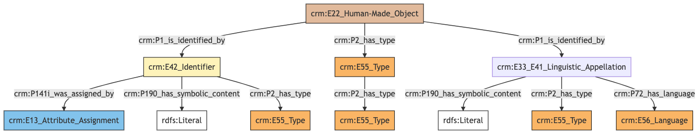
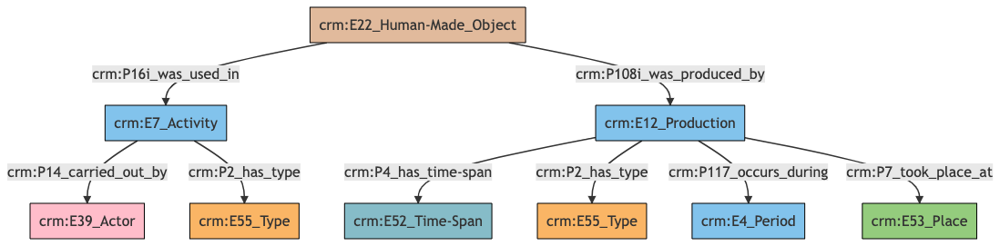
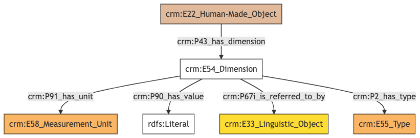
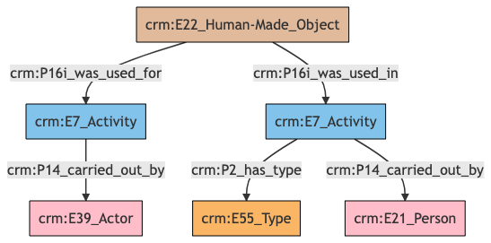
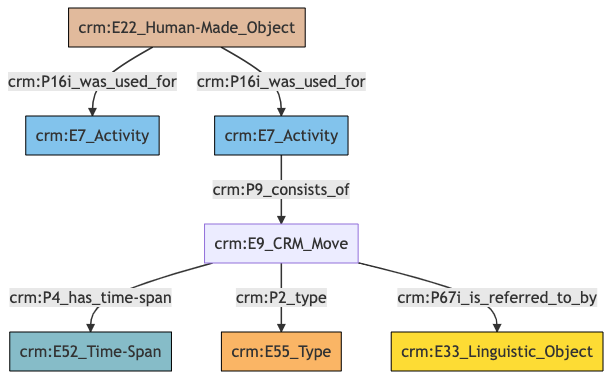
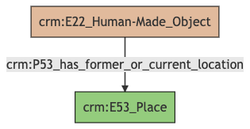
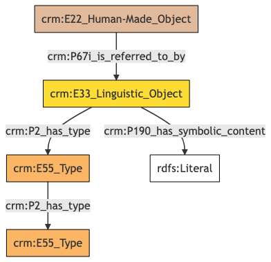
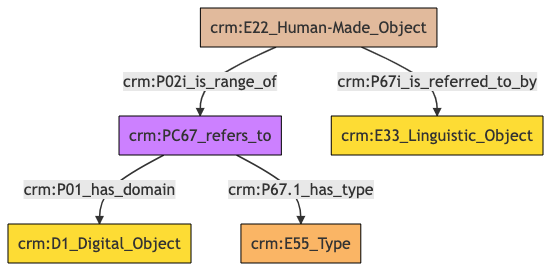

##**Artwork**##

**Author:** Denitsa Nenova, George Bruseker

**Version:** 1.0

The *Artwork* model is intended to enable the representation and sharing of data relevant to human-made, physical items, predominantly works of art such as drawings, painting, prints, etc. The *Artwork* reference data model consists of standard fields describing and defining the object in a cultural heritage data system. The current model intends to accomodate information about the physical work of art at a general description level following established ways of data recording in a museum inventory environment. It is based on standard semantic mappings using CIDOC-CRM and an initial artwork dataset curated by the Philadelphia Museum of Art. Besides the direct mapping of existing artwork related data, the model offers extended fields for additional information in the future having the capacity of digitally born data. 


| | Name| URI | 
|-|-----|-----|
|Root Ontology Node|E22 Human-Made Object | https://cidoc-crm.org/Entity/E22-Human-Made-Object/version-7.1.1|
|Type Differentiator |works of art | http://vocab.getty.edu/aat/300133025 |

**Model Sections Description**

The fields used to describe an artwork can be functionally grouped in generic categories allowing for a convenient navigation with an individual entry. The information categoreis applicable to the *Artwork* refernce model are listed in the table below.

|Information Category | Information Collections | Description | 
|---------------------|-------------------------|-------------|
| Names and Classifications |   Names/Identifiers/Types/Terms  |  The researcher can document various names, titles, types and any unclassified otherwise terms assigned to the *Artwork*.|
|Existence   | Creation |   The researcher can document the events related to the production of an *Artwork*.|
|Substance   | Dimensions | The researcher can document various physical descriptive information about the *Artwork*.|
|Actor Relations | Activity Actor/Curator | The researcher can document variuos relationships between the *Artwork* and an actor.|
|Events   | Moves/Activity Used In (Exhibitions) |   The researcher can document the events related to the move from one location to another or different activies where the *Artwork* was used such as exhibitions.|
|Location   | Location   | The researcher can document the current or former location of the *Artwork*.|
|Description  |  Description |   The researcher can document various free-text descriptions of the *Artwork*.|
|Documentation  |  Reference/Image/File | The researcher can document citations relative to the *Artwork* and link to different documents or images representing the *Artwork*|

## Artwork **Names and Classifications**

The attribution of names and types to an *Artwork*, as with other entities, is a basic human activity. A chief factor in disambiguating *Artworks* lies in understanding the various names and identifiers that have been given to them at different moments in their individual histories. Likewise, additional classifiers of the *Artwork* give important distinguishing characteristics.

| Filed ID    | Name                          | Description | Data Type | CRM Path |
| ----------- | ------------------------------|-------------|-----------|----------|
|LAF.6  |  Title  |  This field is used to record the string value of the name attributed to the documented *Artwork*.  |  String   | ->p1->E33_E41[4_1]->p190->rdf:literal|
|LAF.5   | Title Type  |  This field is used to record the type of the name attributed to the documented *Artwork*.   | Concept  |  ->p1->E33_41[4_1]->p2->E55[5_1]|
|LAF.7  |  Title Language  |  This field is used to record the language of the name attributed to the documented *Artwork*.   | Concept  |  ->p1->E33_E41[4_1]->p72->E56[7_1]|
|LAF.10  |  Identifier  |  This field is used to record an identifier attributed to the documented *Artwork*.  |  String   | ->p1->E42[8_1]->p190->rdf:literal|
|LAF.9  |  Identifier Type  |  This field is used to record the type of the identifier attributed to the documented *Artwork*.  |  Concept  |  ->p1->E42[8_1]->p2->E55[9_1]|
|LAF.434  |  Identifier Assigned By |   This field is used to indicate the details of the data assignment of this identifier to the documented *Artwork*.   | Collection [Data Assignment] |  ->p1->E42[8_1]->p141i->E13[434_1]|
|LAF.11  |  Term  |  This field is used to record the formal type of the documented *Artwork*.  |  Concept |   ->p2->E55[11_1]|
|LAF.12  |  Term Type |   This field is used to record the metatype attributed to a formal classification. The function of a metatype is to enable the programmatic distinction between different kinds of type applied to the same documented *Artwork*.  |  Concept |   ->p2->E55[11_1]->p2->E55 [12_1]|

### - Artwork Names and Classifications **Ontology Graph**



### - Artwork Names and Classifications **RDF**

```
@prefix crm: <http://www.cidoc-crm.org/cidoc-crm/> .
@prefix rdfs: <http://www.w3.org/2000/01/rdf-schema#> .

<https://pma.us/models/physical_thing/E22> a crm:E22_Human-Made_Object ;
    crm:P1_is_identified_by <https://linked.art/example/conceptual_object/4_1>,
        <https://linked.art/example/conceptual_object/8_1> ;
    crm:P2_has_type <https://linked.art/example/type/11_1> .

<http://vocab.getty.edu/page/aat/300404670> a crm:E55_Type ;
    rdfs:label "preferred terms" .

<https://linked.art/example/conceptual_object/4_1> a crm:E33_E41_Linguistic_Appellation ;
    crm:P190_has_symbolic_content "Name_string_value" ;
    crm:P2_has_type <http://vocab.getty.edu/page/aat/300404670> ;
    crm:P72_has_language <https://linked.art/example/type/7_1> .

<https://linked.art/example/conceptual_object/8_1> a crm:E42_Identifier ;
    crm:P141i_was_assigned_by <https://linked.art/example/event/434_1> ;
    crm:P190_has_symbolic_content "Identifier_value_content" ;
    crm:P2_has_type <https://linked.art/example/identifier/9_1> .

<https://linked.art/example/event/434_1> a crm:E13_Attribute_Assignment .

<https://linked.art/example/identifier/9_1> a crm:E55_Type .

<https://linked.art/example/type/11_1> a crm:E55_Type ;
    crm:P2_has_type <https://linked.art/example/type/12_1> .

<https://linked.art/example/type/12_1> a crm:E55_Type .

<https://linked.art/example/type/7_1> a crm:E56_Language .


                
```

### - Artwork Names and Classifications **JOSN-LD**     
```
{
  "@context": "https://linked.art/ns/v1/linked-art.json",
  "@graph": [
    {
      "classified_as": [
        "https://linked.art/example/type/12_1"
      ],
      "id": "https://linked.art/example/type/11_1",
      "type": "Type"
    },
    {
      "id": "https://linked.art/example/event/434_1",
      "type": "AttributeAssignment"
    },
    {
      "id": "https://linked.art/example/type/12_1",
      "type": "Type"
    },
    {
      "id": "https://linked.art/example/identifier/9_1",
      "type": "Type"
    },
    {
      "classified_as": [
        "http://vocab.getty.edu/page/aat/300404670"
      ],
      "content": "Name_string_value",
      "id": "https://linked.art/example/conceptual_object/4_1",
      "language": [
        "https://linked.art/example/type/7_1"
      ],
      "type": "Name"
    },
    {
      "_label": "preferred terms",
      "id": "http://vocab.getty.edu/page/aat/300404670",
      "type": "Type"
    },
    {
      "id": "https://linked.art/example/type/7_1",
      "type": "Language"
    },
    {
      "classified_as": [
        "https://linked.art/example/type/11_1"
      ],
      "id": "https://pma.us/models/physical_thing/E22",
      "identified_by": [
        "https://linked.art/example/conceptual_object/4_1",
        "https://linked.art/example/conceptual_object/8_1"
      ],
      "type": "HumanMadeObject"
    },
    {
      "assigned_by": [
        "https://linked.art/example/event/434_1"
      ],
      "classified_as": [
        "https://linked.art/example/identifier/9_1"
      ],
      "content": "Identifier_value_content",
      "id": "https://linked.art/example/conceptual_object/8_1",
      "type": "Identifier"
    }
  ]
}
                
```

## Artwork **Existence **

Of essential importance in identifying and tracking *Artworks* is information pertaining to their existence in time, particularly information regarding the creation of the *Artwork* as a human-made object. 

| Filed ID    | Name                          | Description | Data Type | CRM Path |
| ----------- | ------------------------------|-------------|-----------|----------|
|LAF.296  |  Creation Period  |  This field is used to link the documented production activity of an *Artwork* to the period during which it occurred.  |  Reference Model [Period]|    ->P108i->E12[295_1]->P117->E4[296_1]|
|LAF.303  |  Creation Type  |  This field is used to record the formal type of the documented production activity of an *Artwork*.   | Concept   | ->P108i->E12[295_1]->P2->E55[303_1]|
|LAF.295  |  Creation Place |   This field is used to link the documented production activity of an *Artwork* to a location at which it was carried out.  |  Reference Model [Place] |  ->P108i->E12[295_1]->P7->E53[295_2]|
|LAF.302  |  Creation Date |   This field is used to link the documented production activity of an *Artwork* to an instance of time-span recording the temporal extent of the activity.  |  Collection [Timespan] |  ->P108i->E12[295_1]->P4->E52[302_1]|
|PMAF.73  |  Role  |  This field is used to document the type of activity where the documented of an *Artwork* was used. |   Concept   | ->p16i->E7[A73_1]->p2->E55[A73_2]|
|PMAF.74  |  Constituent  |  This field is used to document an actor involved in the type of activity where the documented *Artwork* was used.  |  Reference Model [Person/Group]  |  ->p16i->E7[A73_1]->p14->E39[A74_1]|


### - Artwork Existence **Ontology Graph**



### - Artwork Existence **RDF**

```
@prefix crm: <http://www.cidoc-crm.org/cidoc-crm/> .

<https://pma.us/models/physical_thing/E22> a crm:E22_Human-Made_Object ;
    crm:P108i_was_produced_by <https://linked.art/example/event/295_1> ;
    crm:P16i_was_used_in <http://pma.us/event/A73_1> .

<http://pma.us/actor/A74_1> a crm:E39_Actor .

<http://pma.us/event/A73_1> a crm:E7_Activity ;
    crm:P14_carried_out_by <http://pma.us/actor/A74_1> ;
    crm:P2_has_type <http://pma.us/type/A73_2> .

<http://pma.us/type/A73_2> a crm:E55_Type .

<https://linked.art/example/event/295_1> a crm:E12_Production ;
    crm:P117_occurs_during <https://linked.art/example/event/296_1> ;
    crm:P2_has_type <https://linked.art/example/type/303_1> ;
    crm:P4_has_time-span <https://linked.art/example/time_span/302_1> ;
    crm:P7_took_place_at <https://linked.art/example/place/295_2> .

<https://linked.art/example/event/296_1> a crm:E4_Period .

<https://linked.art/example/place/295_2> a crm:E53_Place .

<https://linked.art/example/time_span/302_1> a crm:E52_Time-Span .

<https://linked.art/example/type/303_1> a crm:E55_Type .


```

### - Artwork Existence **JSON-LD**     
```
{
  "@context": "https://linked.art/ns/v1/linked-art.json",
  "@graph": [
    {
      "crm:P16i_was_used_in": {
        "id": "http://pma.us/event/A73_1"
      },
      "id": "https://pma.us/models/physical_thing/E22",
      "produced_by": "https://linked.art/example/event/295_1",
      "type": "HumanMadeObject"
    },
    {
      "id": "https://linked.art/example/type/303_1",
      "type": "Type"
    },
    {
      "id": "https://linked.art/example/time_span/302_1",
      "type": "TimeSpan"
    },
    {
      "id": "https://linked.art/example/place/295_2",
      "type": "Place"
    },
    {
      "id": "https://linked.art/example/event/296_1",
      "type": "Period"
    },
    {
      "carried_out_by": [
        "http://pma.us/actor/A74_1"
      ],
      "classified_as": [
        "http://pma.us/type/A73_2"
      ],
      "id": "http://pma.us/event/A73_1",
      "type": "Activity"
    },
    {
      "classified_as": [
        "https://linked.art/example/type/303_1"
      ],
      "crm:P117_occurs_during": {
        "id": "https://linked.art/example/event/296_1"
      },
      "id": "https://linked.art/example/event/295_1",
      "timespan": "https://linked.art/example/time_span/302_1",
      "took_place_at": [
        "https://linked.art/example/place/295_2"
      ],
      "type": "Production"
    },
    {
      "id": "http://pma.us/type/A73_2",
      "type": "Type"
    },
    {
      "id": "http://pma.us/actor/A74_1",
      "type": "Actor"
    }
  ]
}
            
                
```

## Artwork **Substance**
The analysis and understanding of an *Artwork* depends also on our knowledge of its materiality and physical characteristics. The category of substance brings together descriptors which are relevant to this form of analysis. Particularly, it groups information having to do with the composition and measurable aspects of the physical form of the *Artwork*.
               
| Filed ID    | Name                          | Description | Data Type | CRM Path |
| ----------- | ------------------------------|-------------|-----------|----------|
|LAF.453 |   Dimension Statement |   This field is used to link the dimension of a documented *Artwork* to a statement that describes it.  |  Collection [Statement] |  ->p43->E54[98_1]->P67i->E33[453_1]|
|LAF.99  |  Dimension Unit  |  This field is used to record the unit for the documented instance of dimension of the documented *Artwork*.   | Concept   | ->p43->E54[98_1]->p91->E58[99_1]
|LAF.101 |   Dimension Value  |  This field is used to record the value for the documented instance of dimension of the documented *Artwork*.  |  Integer  |  ->p43->E54[98_1]->p90->rdf:literal|
|LAF.104  |  Dimension Type  |  This field is used to record the formal type of the documented dimension of the documented *Artwork*.  |  Concept  |  ->p43->E54[98_1]->p2->E55[104_1]|


### - Artwork Substance **Ontology Graph**


### - Artwork Substance **RDF**
```
@prefix crm: <http://www.cidoc-crm.org/cidoc-crm/> .

<https://pma.us/models/physical_thing/E22> a crm:E22_Human-Made_Object ;
    crm:P43_has_dimension <https://linked.art/example/dimension/98_1> .

<https://linked.art/example/conceptual_object/453_1> a crm:E33_Linguistic_Object .

<https://linked.art/example/dimension/98_1> a crm:E54_Dimension ;
    crm:P2_has_type <https://linked.art/example/type/104_1> ;
    crm:P67i_is_referred_to_by <https://linked.art/example/conceptual_object/453_1> ;
    crm:P90_has_value "integer" ;
    crm:P91_has_unit <https://linked.art/example/type/99_1> .

<https://linked.art/example/type/104_1> a crm:E55_Type .

<https://linked.art/example/type/99_1> a crm:E58_Measurement_Unit .


                
```


### - Artwork Substance **JSON-LD**
```
{
  "@context": "https://linked.art/ns/v1/linked-art.json",
  "@graph": [
    {
      "dimension": [
        "https://linked.art/example/dimension/98_1"
      ],
      "id": "https://pma.us/models/physical_thing/E22",
      "type": "HumanMadeObject"
    },
    {
      "id": "https://linked.art/example/conceptual_object/453_1",
      "type": "LinguisticObject"
    },
    {
      "id": "https://linked.art/example/type/104_1",
      "type": "Type"
    },
    {
      "classified_as": [
        "https://linked.art/example/type/104_1"
      ],
      "id": "https://linked.art/example/dimension/98_1",
      "referred_to_by": [
        "https://linked.art/example/conceptual_object/453_1"
      ],
      "type": "Dimension",
      "unit": "https://linked.art/example/type/99_1",
      "value": "integer"
    },
    {
      "id": "https://linked.art/example/type/99_1",
      "type": "MeasurementUnit"
    }
  ]
}
                
```

## Artwork **Actor Relations **

The connection between the *Artwork* and different actors, such as creators and donors, provides another important set of descriptors for identifying and tracing an *Artwork*. 

| Filed ID    | Name                          | Description | Data Type | CRM Path |
| ----------- | ------------------------------|-------------|-----------|----------|
|PMAF.73  |  Role |   This field is used to document the type of activity where the documented *Artwork* was used.  |  Concept |   ->p16i->E7[A73_1]->p2->E55[A73_2]|
|LAF.61  |  Department  |  This field is used to link the documented *Artwork* curation activity to an actor responsible for carrying it out. |   Reference Model  [Group]|  ->P16i->E7[58_1]->P14->E39[61_1]|
|PMAF.74  |  Constituent  |  This field is used to document an actor involved in the type of activity where the documented *Artwork* was used.  |  Reference Model [Person] |  ->p16i->E7[A73_1]->p14->E39[A74_1]|

### - Artwork Actor Relations **Ontology Graph**


### - Artwork Actor Relations **RDF**
```
@prefix crm: <http://www.cidoc-crm.org/cidoc-crm/> .

<https://pma.us/models/physical_thing/E22> a crm:E22_Human-Made_Object ;
    crm:P16i_was_used_for <https://linked.art/example/event/58_1> ;
    crm:P16i_was_used_in <http://linked.art/example/event/A73_1> .

<http://linked.art/example/actor/A74_1> a crm:E21_Person .

<http://linked.art/example/event/A73_1> a crm:E7_Activity ;
    crm:P14_carried_out_by <http://linked.art/example/actor/A74_1> ;
    crm:P2_has_type <http://linked.art/example/type/A73_2> .

<http://linked.art/example/type/A73_2> a crm:E55_Type .

<https://linked.art/example/actor/61_1> a crm:E39_Actor .

<https://linked.art/example/event/58_1> a crm:E7_Activity ;
    crm:P14_carried_out_by <https://linked.art/example/actor/61_1> .


                
```

### - Artwork Actor Relations **JSON-LD**
```
{
  "@context": "https://linked.art/ns/v1/linked-art.json",
  "@graph": [
    {
      "carried_out_by": [
        "https://linked.art/example/actor/61_1"
      ],
      "id": "https://linked.art/example/event/58_1",
      "type": "Activity"
    },
    {
      "id": "https://linked.art/example/actor/61_1",
      "type": "Actor"
    },
    {
      "id": "http://linked.art/example/type/A73_2",
      "type": "Type"
    },
    {
      "crm:P16i_was_used_in": {
        "id": "http://linked.art/example/event/A73_1"
      },
      "id": "https://pma.us/models/physical_thing/E22",
      "type": "HumanMadeObject",
      "used_for": [
        "https://linked.art/example/event/58_1"
      ]
    },
    {
      "carried_out_by": [
        "http://linked.art/example/actor/A74_1"
      ],
      "classified_as": [
        "http://linked.art/example/type/A73_2"
      ],
      "id": "http://linked.art/example/event/A73_1",
      "type": "Activity"
    },
    {
      "id": "http://linked.art/example/actor/A74_1",
      "type": "Person"
    }
  ]
}
                
```

## Artwork **Events **
This category brings together typical events in which an *Artwork* may have been involved through the course of its history. At present this enables the documentation of *Artwork* move and transfer and its participation in exhibitions.
 
| Filed ID    | Name                          | Description | Data Type | CRM Path |
| ----------- | ------------------------------|-------------|-----------|----------|
|PMAF.79  |  Transfer Date  |  This field is used to document the timespan of a move event associated with the documented *Artwork*.  |  Collection [Timespan]|    ->p16i_E7[A79_1]->p9->E9[A79_2]->p4->E52[A79_3]|
|PMAF.80 |   Transfer Status |   This field is used to document a statement about the move event associated with the documented *Artwork*.  |  Collection [Statement]|    ->p16i_E7[A79_1]->p9->E9[A79_2]->p67i->E33[A80_1]|
|PMAF.81  |  Transfer Purpose |   This field is used to document the type of the move event associated with the documented *Artwork*.  |  Concept   | ->p16i_E7[A79_1]->p9->E9[A79_2]->p2->E55[A81_1]|
|LAF.57 |   Part of Exhibition  |  This field is used to link the documented *Artwork* to an activity in which it was used.  |  Reference Model  [Exhibition]|  ->P16i->E7[57_1]|


### - Artwork Events **Ontology Graph**


### - Artwork Events **RDF**
```
@prefix crm: <http://www.cidoc-crm.org/cidoc-crm/> .

<https://pma.us/models/physical_thing/E22> a crm:E22_Human-Made_Object ;
    crm:P16i_was_used_for <http://linked.art/example/event/A79_1>,
        <https://linked.art/example/event/57_1> .

<http://linked.art/example/conceptual_object/A80_1> a crm:E33_Linguistic_Object .

<http://linked.art/example/event/A79_1> a crm:E7_Activity ;
    crm:P9_consists_of <http://linked.art/example/event/A79_2> .

<http://linked.art/example/event/A79_2> a crm:E9_CRM_Move ;
    crm:P2_type <http://linked.art/example/type/A81_1> ;
    crm:P4_has_time-span <http://linked.art/example/time_span/A79_3> ;
    crm:P67i_is_referred_to_by <http://linked.art/example/conceptual_object/A80_1> .

<http://linked.art/example/time_span/A79_3> a crm:E52_Time-Span .

<http://linked.art/example/type/A81_1> a crm:E55_Type .

<https://linked.art/example/event/57_1> a crm:E7_Activity .


                
                
```

### - Artwork Events **JSON-LD**
```
{
  "@context": "https://linked.art/ns/v1/linked-art.json",
  "@graph": [
    {
      "crm:P9_consists_of": {
        "id": "http://linked.art/example/event/A79_2"
      },
      "id": "http://linked.art/example/event/A79_1",
      "type": "Activity"
    },
    {
      "id": "http://linked.art/example/time_span/A79_3",
      "type": "TimeSpan"
    },
    {
      "id": "https://linked.art/example/event/57_1",
      "type": "Activity"
    },
    {
      "id": "http://linked.art/example/type/A81_1",
      "type": "Type"
    },
    {
      "id": "https://pma.us/models/physical_thing/E22",
      "type": "HumanMadeObject",
      "used_for": [
        "https://linked.art/example/event/57_1",
        "http://linked.art/example/event/A79_1"
      ]
    },
    {
      "crm:P2_type": {
        "id": "http://linked.art/example/type/A81_1"
      },
      "id": "http://linked.art/example/event/A79_2",
      "referred_to_by": [
        "http://linked.art/example/conceptual_object/A80_1"
      ],
      "timespan": "http://linked.art/example/time_span/A79_3",
      "type": "crm:E9_CRM_Move"
    },
    {
      "id": "http://linked.art/example/conceptual_object/A80_1",
      "type": "LinguisticObject"
    }
  ]
}
                
```

## Artwork **Location**
The documentation of location aids in tracking the present location of individual *Artworks* within an institution. 
               
| Filed ID    | Name                          | Description | Data Type | CRM Path |
| ----------- | ------------------------------|-------------|-----------|----------|
|PMAF.9  |  Crate ID   | This field is used to record the internal location of the documented *Artwork*.  |  Reference Model  |  ->P53->E53[A9_1]|


### - Artwork Events **Ontology Graph**


### - Artwork Events **RDF**
```
@prefix crm: <http://www.cidoc-crm.org/cidoc-crm/> .

<https://pma.us/models/physical_thing/E22> a crm:E22_Human-Made_Object ;
    crm:P53_has_former_or_current_location <https://pma.us/place/A9_1> .

<https://pma.us/place/A9_1> a crm:E53_Place .


                
```


### - Artwork Location **JSON-LD**
```
{
  "@context": "https://linked.art/ns/v1/linked-art.json",
  "@graph": [
    {
      "former_or_current_location": [
        "https://pma.us/place/A9_1"
      ],
      "id": "https://pma.us/models/physical_thing/E22",
      "type": "HumanMadeObject"
    },
    {
      "id": "https://pma.us/place/A9_1",
      "type": "Place"
    }
  ]
}
                
```


## Artwork **Description**
*Artworks* are the subjects of innumerable descriptions that provide a wide range of information with regards to the aesthetic and historical importance of the work. Such descriptions are of use in a scholarly understanding of an object just in case we are able to track the provenance of such elocutions in a systematic fashion. Such an aim drives the need for the tracking of description information as a separate category. 

| Filed ID    | Name                          | Description | Data Type | CRM Path |
| ----------- | ------------------------------|-------------|-----------|----------|
|LAF.15  |  Statement  |  This field is used to record the actual textual content of the statement describing the documented *Artwork*.  |  String   | ->p67i->E33[13_1]->p190->rdf:literal|
|LAF.14  |  Statement Type  |  This field is used to record the formal type of the statement made about the documented *Artwork*.|    Concept   | ->p67i->E33[13_1]->p2->E55[14_1]|

### - Artwork Description **Ontology Graph**


### - Artwork Description **RDF**
```
@prefix crm: <http://www.cidoc-crm.org/cidoc-crm/> .

<https://pma.us/models/physical_thing/E22> a crm:E22_Human-Made_Object ;
    crm:P67i_is_referred_to_by <https://linked.art/example/conceptual_object/13_1> .

<http://vocab.getty.edu/aat/300418049> a crm:E55_Type .

<https://linked.art/example/conceptual_object/13_1> a crm:E33_Linguistic_Object ;
    crm:P190_has_symbolic_content "Statement_string_content" ;
    crm:P2_has_type <https://linked.art/example/type/14_1> .

<https://linked.art/example/type/14_1> a crm:E55_Type ;
    crm:P2_has_type <http://vocab.getty.edu/aat/300418049> .


```

### - Artwork Description **JSON-LD**
```
{
  "@context": "https://linked.art/ns/v1/linked-art.json",
  "@graph": [
    {
      "id": "https://pma.us/models/physical_thing/E22",
      "referred_to_by": [
        "https://linked.art/example/conceptual_object/13_1"
      ],
      "type": "HumanMadeObject"
    },
    {
      "classified_as": [
        "https://linked.art/example/type/14_1"
      ],
      "content": "Statement_string_content",
      "id": "https://linked.art/example/conceptual_object/13_1",
      "type": "LinguisticObject"
    },
    {
      "id": "http://vocab.getty.edu/aat/300418049",
      "type": "Type"
    },
    {
      "classified_as": [
        "http://vocab.getty.edu/aat/300418049"
      ],
      "id": "https://linked.art/example/type/14_1",
      "type": "Type"
    }
  ]
}
                
```


## Artwork **Documentation**
This information category unites referential information about the documented *Artwork*, providing contextual data about it.
               
| Filed ID    | Name                          | Description | Data Type | CRM Path |
| ----------- | ------------------------------|-------------|-----------|----------|
|LAF.173  |  Bibliography  |  This field is used to link the documented *Artwork* to an instance of textual work in which it is documented or mentioned. |   Reference Model [Textual Work] |  ->P67i->E33[173_1]|
|PMAF.83  |  Digital Object |   This field is used to link to an instance of digital resource which serves as a digital reference document for the documented *Artwork*. |    Reference Model [Digital Object]  | ->P02i->PC67[A83_1]->P01->D1[A83_2]|
|PMAF.84  |  Digital Object Type  |  This field is used to link to a type record which indicates the kind of reference supported by the digital resource that serves as a reference for the documented *Artwork*. |   Concept|    ->P02i->PC67[A83_1]->P67.1->E55[A84_1]|


### - Artwork Documentation **Ontology Graph**


### - Artwork Documentation **RDF**
```
@prefix crm: <http://www.cidoc-crm.org/cidoc-crm/> .

<https://pma.us/models/physical_thing/E22> a crm:E22_Human-Made_Object ;
    crm:P02i_is_range_of <https://linked.art/example/reified_property/A83_1> ;
    crm:P67i_is_referred_to_by <https://linked.art/example/conceptual_object/173_1> .

<https://linked.art/example/conceptual_bject/A83_2> a crm:E73_Information_object .

<https://linked.art/example/conceptual_bject/A84_1> a crm:E55_Type .

<https://linked.art/example/conceptual_object/173_1> a crm:E33_Linguistic_Object .

<https://linked.art/example/reified_property/A83_1> a crm:PC67_refers_to ;
    crm:P01_has_domain <https://linked.art/example/conceptual_bject/A83_2> ;
    crm:P67.1_has_type <https://linked.art/example/conceptual_bject/A84_1> .


                

```
### - Artwork Documentation **JSON-LD**
```
{
  "@context": "https://linked.art/ns/v1/linked-art.json",
  "@graph": [
    {
      "crm:P02i_is_range_of": {
        "id": "https://linked.art/example/reified_property/A83_1"
      },
      "id": "https://pma.us/models/physical_thing/E22",
      "referred_to_by": [
        "https://linked.art/example/conceptual_object/173_1"
      ],
      "type": "HumanMadeObject"
    },
    {
      "crm:P01_has_domain": {
        "id": "https://linked.art/example/conceptual_bject/A83_2"
      },
      "crm:P67.1_has_type": {
        "id": "https://linked.art/example/conceptual_bject/A84_1"
      },
      "id": "https://linked.art/example/reified_property/A83_1",
      "type": "crm:PC67_refers_to"
    },
    {
      "id": "https://linked.art/example/conceptual_bject/A84_1",
      "type": "Type"
    },
    {
      "id": "https://linked.art/example/conceptual_object/173_1",
      "type": "LinguisticObject"
    },
    {
      "id": "https://linked.art/example/conceptual_bject/A83_2",
      "type": "crm:E73_Information_object"
    }
  ]
}
                
```
