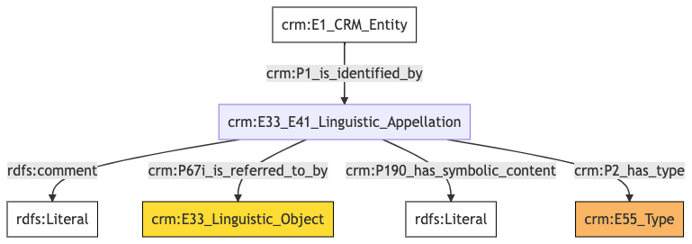
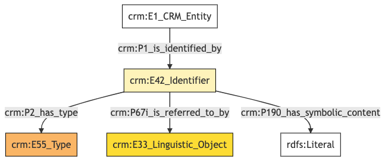
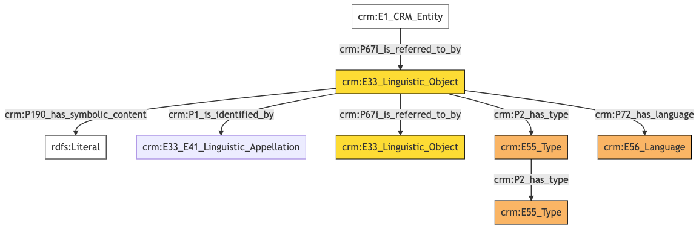
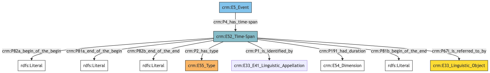
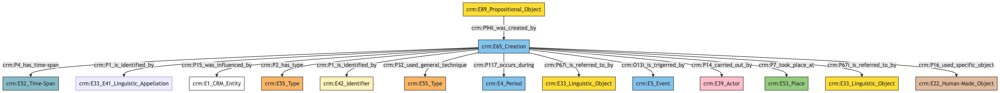
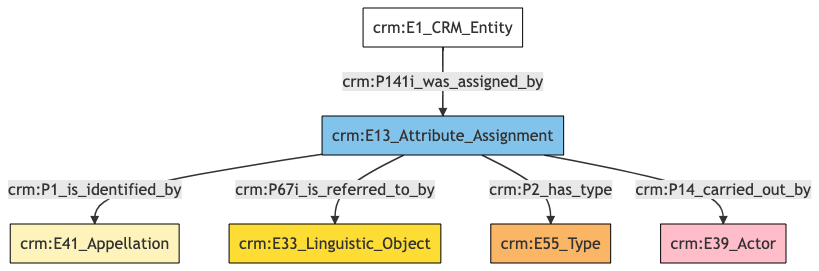

##**Collections**##

**Author:** Denitsa Nenova, George Bruseker

**Version:** 1.0


## Collection **Name**


| Field ID    | Name                          | Data Type| Description  | CRM Path |
| ----------- | ------------------------------|-------------|-----------|----------|
|LAF.4  |  Name Label |   String  |  This field is used to record the string value of the machine readable label used for displaying the instance of name that is used to denote the documented entity.  |  ->p1->E33_41[4_1]->rdfs:label->rdf:literal|
|LAF.5  |  Name Type  |  Concept  |  This field is used to record the type of the name attributed to the documented entity.  |  ->p1->E33_41[4_1]->p2->E55[5_1]|
|LAF.6  |  Name Content  |  String |   This field is used to record the string value of the name attributed to the documented entity.  |  ->p1->E33_E41[4_1]->p190->rdf:literal|
|LAF.44 |   Name Source  |  Reference Model  [Textual Work] |  This field is used to link to a source text in which the name denoting the documented entity is used.    |->p1->E33_E41[4_1]->p67i->E33[44_1]|

### - Collection Name **Ontology Graph**



### - Collection Name **RDF**

```
@prefix crm: <http://www.cidoc-crm.org/cidoc-crm/> .
@prefix rdfs: <http://www.w3.org/2000/01/rdf-schema#> .

<https://pma.us/models/person/E1> a crm:E1_CRM_Entity ;
    crm:P1_is_identified_by <https://linked.art/example/conceptual_object/4_1> .

<http://vocab.getty.edu/page/aat/300404670> a crm:E55_Type ;
    rdfs:label "preferred terms" .

<https://linked.art/example/conceptual_object/4_1> a crm:E33_E41_Linguistic_Appellation ;
    rdfs:label "Name_label_value" ;
    crm:P190_has_symbolic_content "Name_string_value" ;
    crm:P2_has_type <http://vocab.getty.edu/page/aat/300404670> ;
    crm:P67i_is_referred_to_by <https://linked.art/example/textual_object/44_1> ;
    rdfs:comment "LAF.4_name_label" .

<https://linked.art/example/textual_object/44_1> a crm:E33_Linguistic_Object .

```

### - Collection Name **JSON-LD**

```
{
  "@context": "https://linked.art/ns/v1/linked-art.json",
  "@graph": [
    {
      "_label": "preferred terms",
      "id": "http://vocab.getty.edu/page/aat/300404670",
      "type": "Type"
    },
    {
      "id": "https://linked.art/example/textual_object/44_1",
      "type": "LinguisticObject"
    },
    {
      "id": "https://pma.us/models/person/E1",
      "identified_by": [
        "https://linked.art/example/conceptual_object/4_1"
      ],
      "type": "CRMEntity"
    },
    {
      "_label": "Name_label_value",
      "classified_as": [
        "http://vocab.getty.edu/page/aat/300404670"
      ],
      "content": "Name_string_value",
      "id": "https://linked.art/example/conceptual_object/4_1",
      "rdfs:comment": "LAF.4_name_label",
      "referred_to_by": [
        "https://linked.art/example/textual_object/44_1"
      ],
      "type": "Name"
    }
  ]
}
                
```

## Collection **Identifier**


| Field ID    | Name                          | Data Type| Description  | CRM Path |
| ----------- | ------------------------------|-------------|-----------|----------|
|LAF.8  |  Identifier Label |   String |   This field is used to record the string value of the machine readable label used for displaying the instance of identifier that is used to denote the documented entity.   | ->p1->E42[8_1]->rdfs:label->rdf:literal|
|LAF.9  |  Identifier Type  |  Concept  |  This field is used to record the type of the identifier attributed to the documented entity. |   ->p1->E42[8_1]->p2->E55[9_1]|
|LAF.10  |  Identifier Content  |  String  |  This field is used to record an identifier attributed to the documented entity. |   ->p1->E42[8_1]->p190->rdf:literal|
|LAF.45  |  Identifier Source  |  Reference Model [Textual Work] |  This field is used to link to a source text in which the identifier denoting the documented entity is used.    |->p1->E42[8_1]->p67i->E33[45_1]|

### - Collection Identifier **Ontology Graph**



### - Collection Identifier **RDF**

```
@prefix crm: <http://www.cidoc-crm.org/cidoc-crm/> .
@prefix rdfs: <http://www.w3.org/2000/01/rdf-schema#> .

<https://pma.us/models/person/E1> a crm:E1_CRM_Entity ;
    crm:P1_is_identified_by <https://linked.art/example/conceptual_object/8_1> .

<https://linked.art/example/conceptual_object/8_1> a crm:E42_Identifier ;
    rdfs:label "Identifier_label_value" ;
    crm:P190_has_symbolic_content "Identifier_value_content" ;
    crm:P2_has_type <https://linked.art/example/identifier/9_1> ;
    crm:P67i_is_referred_to_by <https://linked.art/example/textual_object/45_1> .

<https://linked.art/example/identifier/9_1> a crm:E55_Type .

<https://linked.art/example/textual_object/45_1> a crm:E33_Linguistic_Object .


```

### - Collection Identifier **JSON-LD**

```
{
  "@context": "https://linked.art/ns/v1/linked-art.json",
  "@graph": [
    {
      "id": "https://linked.art/example/textual_object/45_1",
      "type": "LinguisticObject"
    },
    {
      "_label": "Identifier_label_value",
      "classified_as": [
        "https://linked.art/example/identifier/9_1"
      ],
      "content": "Identifier_value_content",
      "id": "https://linked.art/example/conceptual_object/8_1",
      "referred_to_by": [
        "https://linked.art/example/textual_object/45_1"
      ],
      "type": "Identifier"
    },
    {
      "id": "https://linked.art/example/identifier/9_1",
      "type": "Type"
    },
    {
      "id": "https://pma.us/models/person/E1",
      "identified_by": [
        "https://linked.art/example/conceptual_object/8_1"
      ],
      "type": "CRMEntity"
    }
  ]
}
                
```

## Collection **Statement**


| Field ID    | Name                          | Data Type| Description  | CRM Path |
| ----------- | ------------------------------|-------------|-----------|----------|
|LAF.13  |  Statement Label |   String |   This field is used to record the string value of the machine readable label used for displaying the instance of statement that describes the documented entity.  |  ->p67i->E33[13_1]->rdfs:label->rdf:literal|
|LAF.14  |  Statement Type  |  Concept |   This field is used to record the formal type of the statement made about the documented entity.  |  ->p67i->E33[13_1]->p2->E55[14_1]|
|LAF.15  |  Statement Content |   String  |  This field is used to record the actual textual content of the statement describing the documented entity.   | ->p67i->E33[13_1]->p190->rdf:literal|
|LAF.16  |  Statement Language |   Concept |   This field is used to record the language of the statement describing the documented entity.  |  ->p67i->E33[13_1]->p72->E56[16_1]|
|LAF.50  |  Statement Name  |  Collection [Name] |   This field is used to link to a name attributed to the statement made about the documented entity.   | ->p67i->E33[13_1]->p1->E33_E41[50_1]|
|LAF.55 |   Statement Source |   Reference Model [Textual Work] |   This field is used to link to a source text from which the statement describing the documented entity is derived.  |  ->p67i->E33[13_1]->p67i->E33[55_1]|


### - Collection Statement **Ontology Graph**



### - Collection Statement **RDF**

```
@prefix crm: <http://www.cidoc-crm.org/cidoc-crm/> .
@prefix rdfs: <http://www.w3.org/2000/01/rdf-schema#> .

<https://pma.us/models/person/E1> a crm:E1_CRM_Entity ;
    crm:P67i_is_referred_to_by <https://linked.art/example/conceptual_object/13_1> .

<http://vocab.getty.edu/aat/300418049> a crm:E55_Type .

<https://linked.art/example/conceptual_object/13_1> a crm:E33_Linguistic_Object ;
    rdfs:label "Statement_label_value" ;
    crm:P190_has_symbolic_content "Statement_string_content" ;
    crm:P1_is_identified_by <https://linked.art/example/name/50_1> ;
    crm:P2_has_type <https://linked.art/example/type/14_1> ;
    crm:P67i_is_referred_to_by <https://linked.art/example/statement/55_1> ;
    crm:P72_has_language <https://linked.art/example/type/16_1> .

<https://linked.art/example/name/50_1> a crm:E33_E41_Linguistic_Appellation .

<https://linked.art/example/statement/55_1> a crm:E33_Linguistic_Object .

<https://linked.art/example/type/14_1> a crm:E55_Type ;
    crm:P2_has_type <http://vocab.getty.edu/aat/300418049> .

<https://linked.art/example/type/16_1> a crm:E56_Language .


                
```


### - Collection Statement **JSON-LD**

```
{
  "@context": "https://linked.art/ns/v1/linked-art.json",
  "@graph": [
    {
      "_label": "Statement_label_value",
      "classified_as": [
        "https://linked.art/example/type/14_1"
      ],
      "content": "Statement_string_content",
      "id": "https://linked.art/example/conceptual_object/13_1",
      "identified_by": [
        "https://linked.art/example/name/50_1"
      ],
      "language": [
        "https://linked.art/example/type/16_1"
      ],
      "referred_to_by": [
        "https://linked.art/example/statement/55_1"
      ],
      "type": "LinguisticObject"
    },
    {
      "id": "https://pma.us/models/person/E1",
      "referred_to_by": [
        "https://linked.art/example/conceptual_object/13_1"
      ],
      "type": "CRMEntity"
    },
    {
      "classified_as": [
        "http://vocab.getty.edu/aat/300418049"
      ],
      "id": "https://linked.art/example/type/14_1",
      "type": "Type"
    },
    {
      "id": "https://linked.art/example/statement/55_1",
      "type": "LinguisticObject"
    },
    {
      "id": "http://vocab.getty.edu/aat/300418049",
      "type": "Type"
    },
    {
      "id": "https://linked.art/example/name/50_1",
      "type": "Name"
    },
    {
      "id": "https://linked.art/example/type/16_1",
      "type": "Language"
    }
  ]
}
                
```


## Collection **Timespan**


| Field ID    | Name                          | Data Type| Description | CRM Path |
| ----------- | ------------------------------|-------------|-----------|----------|
|LAF.22  |  Timespan Duration|    Concept |   This field is used to link an instance of timespan with an instance of dimension which describes the temporal duration of the timespan of the documented event.  |  ->p4->E52[22_1]->p191->E54[22_2]|
|LAF.23   | Timespan End of the Begin |   Date  |  This field is used to record the latest possible start date for the timespan of the documented event. |   ->p4->E52[22_1]->p81a->xsl:date|
|LAF.24 |   Timespan Begin of the End |   Date |   This field is used to record the earliest possible end date for the timespan of the documented event.   | ->p4->E52[22_1]->p81b->xsl:date|
|LAF.25  |  Timespan Begin of the Begin  |  Date |   This field is used to record the earliest possible start date for the timespan of the documented event.   | ->p4->E52[22_1]->p82a->xsl:date|
|LAF.26  |  Timespan End of the End  |  Date   | This field is used to record the latest possible end date for the timespan of the documented event.   | ->p4->E52[22_1]->p82b->xsl:date|
|LAF.46  |  Timespan Label  |  String  |  This field is used to record the string value of the machine readable label used for displaying the instance of timespan of the documented event. |   ->p4->E52[22_1]->rdfs:label->rdf:literal|
|LAF.47  |  Timespan Statement |   Collection [Statement]|   This field is used to link to a statement which describes the timespan of the documented event. |   ->p4->E52[22_1]->p67i->E33[47_1]|
|LAF.48  |  Timespan Type  |  Concept |   This field is used to record the formal type of the timespan of the documented event. |   ->p4->E52[22_1]->p2->E55[48_1]|
|LAF.49  |  Timespan Name |   Collection [Name] |   This field is used to link to a name attributed to the timespan of the documented event.  |  ->p4->E52[22_1]->p1->E33_E41[49_1]|


### - Collection Timespan **Ontology Graph**



### - Collection Timespan **RDF**

```
@prefix crm: <http://www.cidoc-crm.org/cidoc-crm/> .
@prefix rdfs: <http://www.w3.org/2000/01/rdf-schema#> .

<https://pma.us/models/person/E5> a crm:E5_Event ;
    crm:P4_has_time-span <https://linked.art/example/time_span/22_1> .

<https://linked.art/example/conceptual_object/47_1> a crm:E33_Linguistic_Object .

<https://linked.art/example/conceptual_object/49_1> a crm:E33_E41_Linguistic_Appellation .

<https://linked.art/example/time_span/22_1> a crm:E52_Time-Span ;
    rdfs:label "timespan_label_value" ;
    crm:P191_had_duration <https://linked.art/example/time_span/22_2> ;
    crm:P1_is_identified_by <https://linked.art/example/conceptual_object/49_1> ;
    crm:P2_has_type <https://linked.art/example/type/48_1> ;
    crm:P67i_is_referred_to_by <https://linked.art/example/conceptual_object/47_1> ;
    crm:P81a_end_of_the_begin "2000-01-01T09:00:00" ;
    crm:P81b_begin_of_the_end "2000-01-01T09:00:00" ;
    crm:P82a_begin_of_the_begin "2000-01-01T09:00:00" ;
    crm:P82b_end_of_the_end "2000-01-01T09:00:00" .

<https://linked.art/example/time_span/22_2> a crm:E54_Dimension .

<https://linked.art/example/type/48_1> a crm:E55_Type .


                
                
```


### - Collection Timespan **JSON-LD**

```
{
  "@context": "https://linked.art/ns/v1/linked-art.json",
  "@graph": [
    {
      "id": "https://linked.art/example/conceptual_object/49_1",
      "type": "Name"
    },
    {
      "_label": "timespan_label_value",
      "classified_as": [
        "https://linked.art/example/type/48_1"
      ],
      "crm:P81a_end_of_the_begin": "2000-01-01T09:00:00",
      "crm:P81b_begin_of_the_end": "2000-01-01T09:00:00",
      "crm:P82a_begin_of_the_begin": "2000-01-01T09:00:00",
      "crm:P82b_end_of_the_end": "2000-01-01T09:00:00",
      "duration": "https://linked.art/example/time_span/22_2",
      "id": "https://linked.art/example/time_span/22_1",
      "identified_by": [
        "https://linked.art/example/conceptual_object/49_1"
      ],
      "referred_to_by": [
        "https://linked.art/example/conceptual_object/47_1"
      ],
      "type": "TimeSpan"
    },
    {
      "id": "https://linked.art/example/time_span/22_2",
      "type": "Dimension"
    },
    {
      "id": "https://linked.art/example/conceptual_object/47_1",
      "type": "LinguisticObject"
    },
    {
      "id": "https://pma.us/models/person/E5",
      "timespan": "https://linked.art/example/time_span/22_1",
      "type": "Event"
    },
    {
      "id": "https://linked.art/example/type/48_1",
      "type": "Type"
    }
  ]
}
                
```


## Collection **Creation**


| Field ID    | Name                          | Data Type| Description  | CRM Path |
| ----------- | ------------------------------|-------------|-----------|----------|
|LAF.71  |  Creation Location |   Reference Model [Place]|   This field is used to link the documented entity creation activity to a location at which it was carried out.   | ->P94i->E65[71_1]->P7->E53[71_2]|
|LAF.84  |  Creation During  |  Reference Model [Period] |   This field is used to link the documented entity creation activity to the period during which it occurred.  |  ->P94i->E65[71_1]->P117->E4[84_1]|
|LAF.85  |  Creation Source  |  Reference Model [Textual Work] |  This field is used to link the documented entity creation activity to a textual source which documents the creation itself.  |  ->P94i->E65[71_1]->P67i->E33[85_1]|
|LAF.86  |  Creation Carried Out By |   Reference Model [Person/Group] |  This field is used to link the documented entity creation activity to an actor responsible for carrying it out.   |  ->P94i->E65[71_1]->P14->E39[86_1]|
|LAF.87  |  Creation Influence  |  Reference Model [Artwork/Textual Work/Person/Group/Place/Period] |  This field is used to link the documented entity creation activity to any entity which had a substantial influence on that activity.  |  ->P94i->E65[71_1]->P15->E1[87_1]|
|LAF.88 |   Creation Name  |  Collection [Name] |  This field is used to link the documented entity creation activity to a name that has been attributed to it.   | ->P94i->E65[71_1]->P1->E33_E41[88_1]|
|LAF.89  |  Creation Used Object |   Concept |   This field is used to link the documented entity creation activity to an instance of physical object used in the exercise of this activity in a manner consequential to its outcome.  |  ->P94i->E65[71_1]->P16->E22[89_1]|
|LAF.90  |  Creation Time |   Collection [Timespan] |  This field is used to link the documented entity creation activity to an instance of time-span recording the temporal extent of the activity. |   ->P94i->E65[71_1]->P4->E52[90_1]|
|LAF.91  |  Creation Type  |  Concept  |  This field is used to record the formal type of the documented entity creation activity. |   ->P94i->E65[71_1]->P2->E55[91_1]|
|LAF.92  |  Creation Label |   String  |  This field is used to record the string value of the machine readable label used for the documented entity creation activity.  |  ->P94i->E65[71_1]->rdfs:label->rdf:literal|
|LAF.93  |  Creation Technique |   Concept  |  This field is used to indicate a kind of technique used in the execution of the documented entity creation activity.  |  ->P94i->E65[71_1]->P32->E55[93_1]|
|LAF.94  |  Creation Identifier |   Collection  [Identifier] | This field is used to link the documented entity creation activity to an identifier that has been attributed to it.  |  ->P94i->E65[71_1]->P1->E42[94_1]|
|LAF.95  |  Creation Statement |   Collection [Statement] |  This field is used to link the documented entity creation activity to a statement that describes it.  |  ->P94i->E65[71_1]->P67i->E33[95_1]|
|LAF.96  |  Creation Caused By  |  Concept |  This field is used to link the documented entity creation activity to another event which was the causal reason behind its coming to be. |   ->P94i->E65[71_1]->O13i->E5[96_1]|

### - Collection Creation **Ontology Graph**



### - Collection Creation **RDF**

```
@prefix crm: <http://www.cidoc-crm.org/cidoc-crm/> .
@prefix rdfs: <http://www.w3.org/2000/01/rdf-schema#> .

<https://pma.us/models/person/E89> a crm:E89_Propositional_Object ;
    crm:P94i_was_created_by <https://linked.art/example/event/71_1> .

<https://linked.art/example/actor/86_1> a crm:E39_Actor .

<https://linked.art/example/conceptual_object/85_1> a crm:E33_Linguistic_Object .

<https://linked.art/example/conceptual_object/95_1> a crm:E33_Linguistic_Object .

<https://linked.art/example/event/71_1> a crm:E65_Creation ;
    rdfs:label "Curation_label_value" ;
    crm:O13i_is_trigerred_by <https://linked.art/example/event/96_1> ;
    crm:P117_occurs_during <https://linked.art/example/event/84_1> ;
    crm:P14_carried_out_by <https://linked.art/example/actor/86_1> ;
    crm:P15_was_influenced_by <https://linked.art/example/thing/87_1> ;
    crm:P16_used_specific_object <https://linked.art/example/physical_object/89_1> ;
    crm:P1_is_identified_by <https://linked.art/example/identifier/94_1>,
        <https://linked.art/example/name/88_1> ;
    crm:P2_has_type <https://linked.art/example/type/91_1> ;
    crm:P32_used_general_technique <https://linked.art/example/type/93_1> ;
    crm:P4_has_time-span <https://linked.art/example/time_span/90_1> ;
    crm:P67i_is_referred_to_by <https://linked.art/example/conceptual_object/85_1>,
        <https://linked.art/example/conceptual_object/95_1> ;
    crm:P7_took_place_at <https://linked.art/example/place/71_2> .

<https://linked.art/example/event/84_1> a crm:E4_Period .

<https://linked.art/example/event/96_1> a crm:E5_Event .

<https://linked.art/example/identifier/94_1> a crm:E42_Identifier .

<https://linked.art/example/name/88_1> a crm:E33_E41_Linguistic_Appellation .

<https://linked.art/example/physical_object/89_1> a crm:E22_Human-Made_Object .

<https://linked.art/example/place/71_2> a crm:E53_Place .

<https://linked.art/example/thing/87_1> a crm:E1_CRM_Entity .

<https://linked.art/example/time_span/90_1> a crm:E52_Time-Span .

<https://linked.art/example/type/91_1> a crm:E55_Type .

<https://linked.art/example/type/93_1> a crm:E55_Type .


                
```


### - Collection Creation **JSON-LD**

```
{
  "@context": "https://linked.art/ns/v1/linked-art.json",
  "@graph": [
    {
      "id": "https://linked.art/example/type/91_1",
      "type": "Type"
    },
    {
      "id": "https://linked.art/example/event/96_1",
      "type": "Event"
    },
    {
      "id": "https://linked.art/example/conceptual_object/85_1",
      "type": "LinguisticObject"
    },
    {
      "id": "https://linked.art/example/time_span/90_1",
      "type": "TimeSpan"
    },
    {
      "id": "https://linked.art/example/event/84_1",
      "type": "Period"
    },
    {
      "id": "https://linked.art/example/thing/87_1",
      "type": "CRMEntity"
    },
    {
      "_label": "Curation_label_value",
      "carried_out_by": [
        "https://linked.art/example/actor/86_1"
      ],
      "classified_as": [
        "https://linked.art/example/type/91_1"
      ],
      "crm:O13i_is_trigerred_by": {
        "id": "https://linked.art/example/event/96_1"
      },
      "crm:P117_occurs_during": {
        "id": "https://linked.art/example/event/84_1"
      },
      "id": "https://linked.art/example/event/71_1",
      "identified_by": [
        "https://linked.art/example/name/88_1",
        "https://linked.art/example/identifier/94_1"
      ],
      "influenced_by": [
        "https://linked.art/example/thing/87_1"
      ],
      "referred_to_by": [
        "https://linked.art/example/conceptual_object/95_1",
        "https://linked.art/example/conceptual_object/85_1"
      ],
      "technique": [
        "https://linked.art/example/type/93_1"
      ],
      "timespan": "https://linked.art/example/time_span/90_1",
      "took_place_at": [
        "https://linked.art/example/place/71_2"
      ],
      "type": "Creation",
      "used_specific_object": [
        "https://linked.art/example/physical_object/89_1"
      ]
    },
    {
      "id": "https://linked.art/example/physical_object/89_1",
      "type": "HumanMadeObject"
    },
    {
      "id": "https://linked.art/example/conceptual_object/95_1",
      "type": "LinguisticObject"
    },
    {
      "created_by": "https://linked.art/example/event/71_1",
      "id": "https://pma.us/models/person/E89",
      "type": "PropositionalObject"
    },
    {
      "id": "https://linked.art/example/type/93_1",
      "type": "Type"
    },
    {
      "id": "https://linked.art/example/actor/86_1",
      "type": "Actor"
    },
    {
      "id": "https://linked.art/example/place/71_2",
      "type": "Place"
    },
    {
      "id": "https://linked.art/example/identifier/94_1",
      "type": "Identifier"
    },
    {
      "id": "https://linked.art/example/name/88_1",
      "type": "Name"
    }
  ]
}
                
```

## Collection **Data Assignment**


| Field ID    | Name                          | Data Type| Description  | CRM Path |
| ----------- | ------------------------------|-------------|-----------|----------|
|LAF.429  |  Data Assigner  |  Reference Model [Person/Group] |  This field is used to indicate the actor responsible for the event of data assignment.  |  ->p140i->E13[429_1]->P14->E39[429_2]|
|LAF.430  |  Type of Data Assignment  |  Concept  |  This field is used to indicate the type of the event of data assignment.| ->p140i->E13[429_1]->P2->E55[430_1]|
|LAF.431  |  Data Assignment Label  |  String  |  This field is used to indicate the machine readable label for the event of data assignment.  |  ->p140i->E13[429_1]->rdfs:label->rdf:literal|
|LAF.432  |  Name of Data Assignment  |  Collection [Name] |   This field is used to indicate the name given to the event of data assignment.  |  ->p140i->E13[429_1]->p1->E41[432_1]|
|LAF.552  |  Statement about Data Assignment  |  Collection [Statement]|   This field is used to document free text statements about the event of data assignment.  |  ->p140i->E13[429_1]->p67i->E33[552_1]|

### - Collection Data Assignment **Ontology Graph**



### - Collection Data Assignment **RDF**

```
@prefix crm: <http://www.cidoc-crm.org/cidoc-crm/> .
@prefix rdfs: <http://www.w3.org/2000/01/rdf-schema#> .

<https://pma.us/models/person/E1> a crm:E1_CRM_Entity ;
    crm:P141i_was_assigned_by <https://linked.art/example/event/429_1> .

<https://linked.art/example/actor/430_1> a crm:E39_Actor .

<https://linked.art/example/conceptual_object/552_1> a crm:E33_Linguistic_Object .

<https://linked.art/example/event/429_1> a crm:E13_Attribute_Assignment ;
    rdfs:label "Value here" ;
    crm:P14_carried_out_by <https://linked.art/example/actor/430_1> ;
    crm:P1_is_identified_by <https://linked.art/example/name/432_1> ;
    crm:P2_has_type <https://linked.art/example/type/431_1> ;
    crm:P67i_is_referred_to_by <https://linked.art/example/conceptual_object/552_1> .

<https://linked.art/example/name/432_1> a crm:E41_Appellation .

<https://linked.art/example/type/431_1> a crm:E55_Type .


                
```


### - Collection Data Assignment **JSON-LD**

```
{
  "@context": "https://linked.art/ns/v1/linked-art.json",
  "@graph": [
    {
      "assigned_by": [
        "https://linked.art/example/event/429_1"
      ],
      "id": "https://pma.us/models/person/E1",
      "type": "CRMEntity"
    },
    {
      "id": "https://linked.art/example/conceptual_object/552_1",
      "type": "LinguisticObject"
    },
    {
      "id": "https://linked.art/example/type/431_1",
      "type": "Type"
    },
    {
      "id": "https://linked.art/example/name/432_1",
      "type": "Appellation"
    },
    {
      "_label": "Value here",
      "carried_out_by": [
        "https://linked.art/example/actor/430_1"
      ],
      "classified_as": [
        "https://linked.art/example/type/431_1"
      ],
      "id": "https://linked.art/example/event/429_1",
      "identified_by": [
        "https://linked.art/example/name/432_1"
      ],
      "referred_to_by": [
        "https://linked.art/example/conceptual_object/552_1"
      ],
      "type": "AttributeAssignment"
    },
    {
      "id": "https://linked.art/example/actor/430_1",
      "type": "Actor"
    }
  ]
}
                

```
