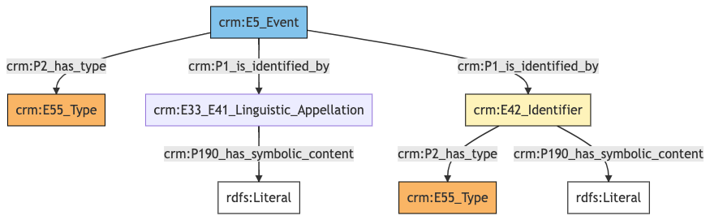
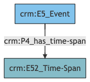
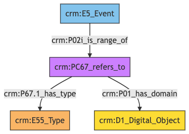

##**Event**##

**Author:** Denitsa Nenova, George Bruseker

**Version:** 1.0

The *Event* reference data model provides a list of standard fields that are typically present in the general description of an *Event*, taken in the sense of planned public or social occasions, organized towards some purpose. Examples of *Events* would be workshops, meetings, conferences, congresses and so on. The aim of this reference model is to cover basic descriptors that are typically employed in the documentation of an *Event*. This reference model aims to remain at a general level description, providing a consolidated, high-level reference data model of most commonly reused descriptors for an *Event* as such and to provide for these, in turn, a set of standard semantic mappings to the CIDOC CRM.


| | Name| URI | 
|-|-----|-----|
|Root Ontology Node|E5 Event|https://cidoc-crm.org/Entity/E5-Event/version-7.1.1 |
|Type Differentiator|N/A|N/A|

**Model Sections Description**

|Information Category | Information Collections | Description | 
|---------------------|-------------------------|-------------|
|Names and Classifications    |Names/Alternative Names/Identifiers/Type|    The researcher can document various names and classification regarding the *Event*.|
|Existence |  Existence   | The researcher can document various free text descriptions of the *Event*.|
|Documentation  |Digital Object|   The researcher can document citations relative to the period, link to images related to period and document external URIs of documentation for the same *Event*.   | 

## Event **Names and Classifications**

The attribution of names and types to *Events*, as with other entities, is a basic human activity. A chief factor in disambiguating *Events* lies in understanding the various names and identifiers that have been given to them at different moments in their individual histories. Historical *Events* often receive different names according to the groups naming it, as well as receiving different kinds of names according to contexts (such as abbreviations and so on). Likewise, additional classifiers of the *Event*, such as how it has been formally categorized, give important distinguishing characteristics.

| Filed ID    | Name                          | Description | Data Type | CRM Path |
| ----------- | ------------------------------|-------------|-----------|----------|
|LAF.6 |   Event Name  |  This field is used to record the string value of the name attributed to the documented *Event*. |   String   | ->p1->E33_E41[4_1]->p190->rdf:literal|
|LAF.11 |   Event Type |   This field is used to record the formal type of the documented *Event*. |   Concept  |  ->p2->E55[11_1]|
|LAF.10 |   Event ID  |  This field is used to record an identifier attributed to the documented *Event*.  |  String  |  ->p1->E42[8_1]->p190->rdf:literal|
|LAF.9  |  ID Type  |  This field is used to record the type of the identifier attributed to the documented *Event*. |   Concept  |  ->p1->E42[8_1]->p2->E55[9_1]|

### - Event Names and Classifications **Ontology Graph**


### - Event Names and Classifications **RDF**

```
@prefix crm: <http://www.cidoc-crm.org/cidoc-crm/> .

<https://pma.us/models/event/E5> a crm:E5_Event ;
    crm:P1_is_identified_by <https://linked.art/example/conceptual_object/4_1>,
        <https://linked.art/example/conceptual_object/8_1> ;
    crm:P2_has_type <https://linked.art/example/type/11_1> .

<https://linked.art/example/conceptual_object/4_1> a crm:E33_E41_Linguistic_Appellation ;
    crm:P190_has_symbolic_content "Name_string_value" .

<https://linked.art/example/conceptual_object/8_1> a crm:E42_Identifier ;
    crm:P190_has_symbolic_content "Identifier_value_content" ;
    crm:P2_has_type <https://linked.art/example/identifier/9_1> .

<https://linked.art/example/identifier/9_1> a crm:E55_Type .

<https://linked.art/example/type/11_1> a crm:E55_Type .


                
```


### - Event Names and Classifications **JSON**

```
{
  "@context": "https://linked.art/ns/v1/linked-art.json",
  "@graph": [
    {
      "content": "Name_string_value",
      "id": "https://linked.art/example/conceptual_object/4_1",
      "type": "Name"
    },
    {
      "classified_as": [
        "https://linked.art/example/identifier/9_1"
      ],
      "content": "Identifier_value_content",
      "id": "https://linked.art/example/conceptual_object/8_1",
      "type": "Identifier"
    },
    {
      "id": "https://linked.art/example/identifier/9_1",
      "type": "Type"
    },
    {
      "id": "https://linked.art/example/type/11_1",
      "type": "Type"
    },
    {
      "classified_as": [
        "https://linked.art/example/type/11_1"
      ],
      "id": "https://pma.us/models/event/E5",
      "identified_by": [
        "https://linked.art/example/conceptual_object/4_1",
        "https://linked.art/example/conceptual_object/8_1"
      ],
      "type": "Event"
    }
  ]
}
                
```

## Event **Existence**

The existence of an *Event* must be determined by documentary or physical evidence of the past. The documentation of the existence of an *Event*, however, essentially relates to ascribing that *Event* dates, where possible, durations otherwise, and a description of the temporality where none of the above is possible. The descriptors and mappings for these potentialities are documented in the table below.

| Filed ID    | Name                          | Description | Data Type | CRM Path |
| ----------- | ------------------------------|-------------|-----------|----------|
|LAF.177 |   Event Timespan |   This field is used to link the documented temporal *Event* to an instance of time-span recording the temporal extent of the *Event*. |   Collection [Timespan] |  ->P4->E52[177_1]|

### - Event Existence **Ontology Graph**


### - Event Existence **RDF**

```
@prefix crm: <http://www.cidoc-crm.org/cidoc-crm/> .

<https://pma.us/models/event/E5> a crm:E5_Event ;
    crm:P4_has_time-span <https://linked.art/example/time_span/177_1> .

<https://linked.art/example/time_span/177_1> a crm:E52_Time-Span .


                
```

### - Event Existence **JSON-LD**

```
{
  "@context": "https://linked.art/ns/v1/linked-art.json",
  "@graph": [
    {
      "id": "https://linked.art/example/time_span/177_1",
      "type": "TimeSpan"
    },
    {
      "id": "https://pma.us/models/event/E5",
      "timespan": "https://linked.art/example/time_span/177_1",
      "type": "Event"
    }
  ]
}
                
```


## Event **Documentation**

This information category unites referential information about the documented *Event*, providing contextual data about it.

| Filed ID    | Name                          | Description | Data Type | CRM Path |
| ----------- | ------------------------------|-------------|-----------|----------|
|PMAF.83  |  Digital Object |   This field is used to link to an instance of digital resource which serves as a digital reference document for the documented *Event*.  |  Reference Model [Digital Object] |  ->P02i->PC67[A83_1]->P01->D1[A83_2]|
|PMAF.84  |  Digital Object Type |   This field is used to link to a type record which indicates the kind of reference supported by the digital resource that serves as a reference for the documented *Event*.   | Concept   | ->P02i->PC67[A83_1]->P67.1->E55[A84_1]|

### - Event Documentation **Ontology Graph**


### - Event Documentation **RDF**

```
@prefix crm: <http://www.cidoc-crm.org/cidoc-crm/> .

<https://pma.us/models/event/E5> a crm:E5_Event ;
    crm:P02i_is_range_of <https://linked.art/example/reified_property/A83_1> .

<https://linked.art/example/conceptual_object/A83_2> a crm:D1_Digital_Object .

<https://linked.art/example/conceptual_object/A84_1> a crm:E55_Type .

<https://linked.art/example/reified_property/A83_1> a crm:PC67_refers_to ;
    crm:P01_has_domain <https://linked.art/example/conceptual_object/A83_2> ;
    crm:P67.1_has_type <https://linked.art/example/conceptual_object/A84_1> .


                
```

### - Event Documentation **JSON-LD**


```
{
  "@context": "https://linked.art/ns/v1/linked-art.json",
  "@graph": [
    {
      "id": "https://linked.art/example/conceptual_object/A84_1",
      "type": "Type"
    },
    {
      "crm:P02i_is_range_of": {
        "id": "https://linked.art/example/reified_property/A83_1"
      },
      "id": "https://pma.us/models/event/E5",
      "type": "Event"
    },
    {
      "id": "https://linked.art/example/conceptual_object/A83_2",
      "type": "crm:D1_Digital_Object"
    },
    {
      "crm:P01_has_domain": {
        "id": "https://linked.art/example/conceptual_object/A83_2"
      },
      "crm:P67.1_has_type": {
        "id": "https://linked.art/example/conceptual_object/A84_1"
      },
      "id": "https://linked.art/example/reified_property/A83_1",
      "type": "crm:PC67_refers_to"
    }
  ]
}
                
```
