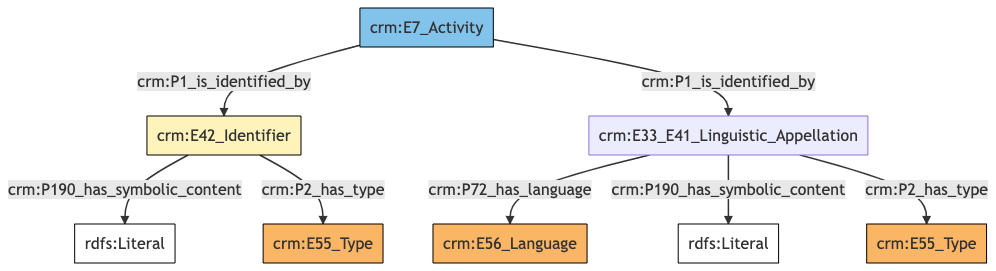
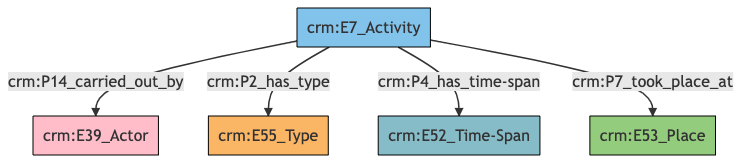
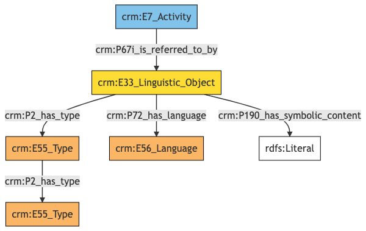
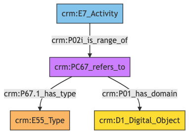

##**Exhibition**##

**Author:** Denitsa Nenova, George Bruseker

**Version:** 1.0

The *Exhibition* reference data model provides a list of standard fields that are typically present in the general description of an *Exhibition*, taken in the sense of planned public or social occasion, organized towards some purpose. The aim of this reference model is to cover basic descriptors that are typically employed in the documentation of an *Exhibition*. This reference model aims to remain at a general level description, providing a consolidated, high-level reference data model of most commonly reused descriptors for an *Exhibition* as such and to provide for these, in turn, a set of standard semantic mappings to the CIDOC CRM. 


| | Name| URI | 
|-|-----|-----|
|Root Ontology Node|E7 Activity |https://cidoc-crm.org/Entity/E7-Activity/version-7.1.1 |
|Type Differentiator|exhibitions (events)|http://vocab.getty.edu/aat/300054766|

T**Model Sections Description**

|Information Category | Information Collections | Description | 
|---------------------|-------------------------|-------------|
|Names and Classifications    |Names/Alternative Names/Identifiers|   The researcher can document various names and classification regarding the *Exhibition*.|
|Existence    |Creation|    The researcher can document the events related to the formation of the *Exhibition*.|
|Description |   Description  |  The researcher can document various free-text descriptions of the *Exhibition*.|
|Documentation    |Digital Resource|The researcher can document various weblinks and images related to the *Exhibition*.|


## Exhibition **Names and Classifications**

The attribution of names and types to events such as *Exhibitions*, as with other entities, is a basic human activity. A chief factor in disambiguating *Exhibitions* lies in understanding the various names and identifiers that have been given to them at different moments in their individual histories. Historical events often receive different names according to the groups naming it. Likewise, additional classifiers of the event, such as how it has been formally categorized, give important distinguishing characteristics.

| Filed ID    | Name                          | Description | Data Type | CRM Path |
| ----------- | ------------------------------|-------------|-----------|----------|
|LAF.6 |   Exhibition Name |   This field is used to record the string value of the name attributed to the documented *Exhibition*.  |  String   | ->p1->E33_E41[4_1]->p190->rdf:literal|
|LAF.5 |   Name Type |   This field is used to record the type of the name attributed to the documented *Exhibition*.  |  Concept   | ->p1->E33_41[4_1]->p2->E55[5_1]
|LAF.7   | Exhibition Name Language |   This field is used to record the language of the name attributed to the documented *Exhibition*.  |  Concept   | ->p1->E33_E41[4_1]->p72->E56[7_1]|
|LAF.10  |  Exhibition ID |   This field is used to record an identifier attributed to the documented *Exhibition*.  |  String  |  ->p1->E42[8_1]->p190->rdf:literal|
|LAF.9  |  Identifier Type  |  This field is used to record the type of the identifier attributed to the documented *Exhibition*. |   Concept   | ->p1->E42[8_1]->p2->E55[9_1]|

### - Exhibition Names and Classifications **Ontology Graph**


### - Exhibition Names and Classifications **RDF**

```
@prefix crm: <http://www.cidoc-crm.org/cidoc-crm/> .
@prefix rdfs: <http://www.w3.org/2000/01/rdf-schema#> .

<https://pma.us/models/exhibition_concept/E7> a crm:E7_Activity ;
    crm:P1_is_identified_by <https://linked.art/example/conceptual_object/4_1>,
        <https://linked.art/example/conceptual_object/8_1> .

<http://vocab.getty.edu/page/aat/300404670> a crm:E55_Type ;
    rdfs:label "preferred terms" .

<https://linked.art/example/conceptual_object/4_1> a crm:E33_E41_Linguistic_Appellation ;
    crm:P190_has_symbolic_content "Name_string_value" ;
    crm:P2_has_type <http://vocab.getty.edu/page/aat/300404670> ;
    crm:P72_has_language <https://linked.art/example/type/7_1> .

<https://linked.art/example/conceptual_object/8_1> a crm:E42_Identifier ;
    crm:P190_has_symbolic_content "Identifier_value_content" ;
    crm:P2_has_type <https://linked.art/example/identifier/9_1> .

<https://linked.art/example/identifier/9_1> a crm:E55_Type .

<https://linked.art/example/type/7_1> a crm:E56_Language .


                


                
```


### - Exhibition Names and Classifications **JSON-LD**

```
{
  "@context": "https://linked.art/ns/v1/linked-art.json",
  "@graph": [
    {
      "_label": "preferred terms",
      "id": "http://vocab.getty.edu/page/aat/300404670",
      "type": "Type"
    },
    {
      "classified_as": [
        "https://linked.art/example/identifier/9_1"
      ],
      "content": "Identifier_value_content",
      "id": "https://linked.art/example/conceptual_object/8_1",
      "type": "Identifier"
    },
    {
      "classified_as": [
        "http://vocab.getty.edu/page/aat/300404670"
      ],
      "content": "Name_string_value",
      "id": "https://linked.art/example/conceptual_object/4_1",
      "language": [
        "https://linked.art/example/type/7_1"
      ],
      "type": "Name"
    },
    {
      "id": "https://linked.art/example/identifier/9_1",
      "type": "Type"
    },
    {
      "id": "https://pma.us/models/exhibition_concept/E7",
      "identified_by": [
        "https://linked.art/example/conceptual_object/4_1",
        "https://linked.art/example/conceptual_object/8_1"
      ],
      "type": "Activity"
    },
    {
      "id": "https://linked.art/example/type/7_1",
      "type": "Language"
    }
  ]
}
                
                
```


## Exhibition **Existence**

The existence of an *Exhibition* must be determined by documentary or physical evidence of the past. The documentation of the existence of an *Exhibition*, however, essentially relates to ascribing that *Exhibition* dates, where possible, durations otherwise, and a description of the temporality where none of the above is possible. The descriptors and mappings for these potentialities are documented in the table below.

| Filed ID    | Name                          | Description | Data Type | CRM Path |
| ----------- | ------------------------------|-------------|-----------|----------|
|LAF.19 |   Exhibition Place  |  This field is used to link the documented *Exhibition* to an instance of place at which it occurred.  |  Reference Model  [Place]|  ->p7->E53[19_1]|
|LAF.21  |  Department |    This field is used to link the documented *Exhibition* to an instance of actor who was causally involved in the execution of the *Exhibition*.  |  Reference Model [Person/Group] |   ->p14->E39[21_1]|
|LAF.177  |  Exhibition Date  |  This field is used to link the documented temporal entity to an instance of time-span recording the temporal extent of the *Exhibition*.  |  Collection [Timespan] |   ->P4->E52[177_1]|
|LAF.11  |  Exhibition creation type  |  This field is used to record the formal type of the documented *Exhibition*. |   Concept  |  ->p2->E55[11_1]|

### - Exhibition Existence **Ontology Graph**


### - Exhibition Existence **RDF**

```
@prefix crm: <http://www.cidoc-crm.org/cidoc-crm/> .

<https://pma.us/models/exhibition_concept/E7> a crm:E7_Activity ;
    crm:P14_carried_out_by <https://linked.art/example/actor/21_1> ;
    crm:P2_has_type <https://linked.art/example/type/11_1> ;
    crm:P4_has_time-span <https://linked.art/example/time_span/177_1> ;
    crm:P7_took_place_at <https://linked.art/example/place/19_1> .

<https://linked.art/example/actor/21_1> a crm:E39_Actor .

<https://linked.art/example/place/19_1> a crm:E53_Place .

<https://linked.art/example/time_span/177_1> a crm:E52_Time-Span .

<https://linked.art/example/type/11_1> a crm:E55_Type .


                
                
```

### - Exhibition Existence **JSON-LD**

```
{
  "@context": "https://linked.art/ns/v1/linked-art.json",
  "@graph": [
    {
      "id": "https://linked.art/example/type/11_1",
      "type": "Type"
    },
    {
      "id": "https://linked.art/example/actor/21_1",
      "type": "Actor"
    },
    {
      "carried_out_by": [
        "https://linked.art/example/actor/21_1"
      ],
      "classified_as": [
        "https://linked.art/example/type/11_1"
      ],
      "id": "https://pma.us/models/exhibition_concept/E7",
      "timespan": "https://linked.art/example/time_span/177_1",
      "took_place_at": [
        "https://linked.art/example/place/19_1"
      ],
      "type": "Activity"
    },
    {
      "id": "https://linked.art/example/place/19_1",
      "type": "Place"
    },
    {
      "id": "https://linked.art/example/time_span/177_1",
      "type": "TimeSpan"
    }
  ]
}
                           
```

## Exhibition **Description**

*Exhibitions* are the subjects of innumerable descriptions that provide a wide range of information with regards to what took place during the event and how, as well as providing interpretations of its significance and import. Such descriptions are of use in a scholarly understanding of an *Exhibition* just in case we are able to track the provenance of such elocutions in a systematic fashion. Such an aim drives the need for the tracking of description information as a separate category. The descriptors necessary for this task are documented in the table below.

| Filed ID    | Name                          | Description | Data Type | CRM Path |
| ----------- | ------------------------------|-------------|-----------|----------|
|LAF.14  |  Statement Type |   This field is used to record the formal type of the statement made about the documented *Exhibition*. |   Concept  |  ->p67i->E33[13_1]->p2->E55[14_1]|
|LAF.15 |   Statement  |   This field is used to record the actual textual content of the statement describing the documented *Exhibition*. |   String   | ->p67i->E33[13_1]->p190->rdf:literal|
|LAF.16 |   Statement Language  |  This field is used to record the language of the statement describing the documented *Exhibition*.   | Concept   | ->p67i->E33[13_1]->p72->E56[16_1]|

### - Exhibition Description **Ontology Graph**


### - Exhibition Description **RDF**

```
@prefix crm: <http://www.cidoc-crm.org/cidoc-crm/> .

<https://pma.us/models/exhibition_concept/E7> a crm:E7_Activity ;
    crm:P67i_is_referred_to_by <https://linked.art/example/conceptual_object/13_1> .

<http://vocab.getty.edu/aat/300418049> a crm:E55_Type .

<https://linked.art/example/conceptual_object/13_1> a crm:E33_Linguistic_Object ;
    crm:P190_has_symbolic_content "Statement_string_content" ;
    crm:P2_has_type <https://linked.art/example/type/14_1> ;
    crm:P72_has_language <https://linked.art/example/type/16_1> .

<https://linked.art/example/type/14_1> a crm:E55_Type ;
    crm:P2_has_type <http://vocab.getty.edu/aat/300418049> .

<https://linked.art/example/type/16_1> a crm:E56_Language .


                
                
```

### - Exhibition Description **JSON-LD**

```
{
  "@context": "https://linked.art/ns/v1/linked-art.json",
  "@graph": [
    {
      "id": "http://vocab.getty.edu/aat/300418049",
      "type": "Type"
    },
    {
      "id": "https://pma.us/models/exhibition_concept/E7",
      "referred_to_by": [
        "https://linked.art/example/conceptual_object/13_1"
      ],
      "type": "Activity"
    },
    {
      "id": "https://linked.art/example/type/16_1",
      "type": "Language"
    },
    {
      "classified_as": [
        "https://linked.art/example/type/14_1"
      ],
      "content": "Statement_string_content",
      "id": "https://linked.art/example/conceptual_object/13_1",
      "language": [
        "https://linked.art/example/type/16_1"
      ],
      "type": "LinguisticObject"
    },
    {
      "classified_as": [
        "http://vocab.getty.edu/aat/300418049"
      ],
      "id": "https://linked.art/example/type/14_1",
      "type": "Type"
    }
  ]
}
                
                
```


## Exhibition **Documentation**

This information category unites referential information about the documented *Exhibition*, providing contextual data about it.

| Filed ID    | Name                          | Description | Data Type | CRM Path |
| ----------- | ------------------------------|-------------|-----------|----------|
|PMAF.83  |  Digital Object  |  This field is used to link to an instance of digital resource which serves as a digital reference document for the documented *Exhibition*.  |  Reference Model  [Digital Object] | ->P02i->PC67[A83_1]->P01->D1[A83_2]|
|PMAF.84  |  Digital Object Type |   This field is used to link to a type record which indicates the kind of reference supported by the digital resource that serves as a reference for the documented *Exhibition*. |   Concept   | ->P02i->PC67[A83_1]->P67.1->E55[A84_1]|

### - Exhibition Documentation **Ontology Graph**


### - Exhibition Documentation **RDF**

```
@prefix crm: <http://www.cidoc-crm.org/cidoc-crm/> .

<https://pma.us/models/exhibition_concept/E7> a crm:E7_Activity ;
    crm:P02i_is_range_of <https://linked.art/example/reified_property/A83_1> .

<https://linked.art/example/conceptual_object/A83_2> a crm:D1_Digital_Object .

<https://linked.art/example/conceptual_object/A84_1> a crm:E55_Type .

<https://linked.art/example/reified_property/A83_1> a crm:PC67_refers_to ;
    crm:P01_has_domain <https://linked.art/example/conceptual_object/A83_2> ;
    crm:P67.1_has_type <https://linked.art/example/conceptual_object/A84_1> .


                
```


### - Exhibition Documentation **JSON-LD**

```
{
  "@context": "https://linked.art/ns/v1/linked-art.json",
  "@graph": [
    {
      "id": "https://linked.art/example/conceptual_object/A84_1",
      "type": "Type"
    },
    {
      "crm:P02i_is_range_of": {
        "id": "https://linked.art/example/reified_property/A83_1"
      },
      "id": "https://pma.us/models/exhibition_concept/E7",
      "type": "Activity"
    },
    {
      "id": "https://linked.art/example/conceptual_object/A83_2",
      "type": "crm:D1_Digital_Object"
    },
    {
      "crm:P01_has_domain": {
        "id": "https://linked.art/example/conceptual_object/A83_2"
      },
      "crm:P67.1_has_type": {
        "id": "https://linked.art/example/conceptual_object/A84_1"
      },
      "id": "https://linked.art/example/reified_property/A83_1",
      "type": "crm:PC67_refers_to"
    }
  ]
}
                
```
