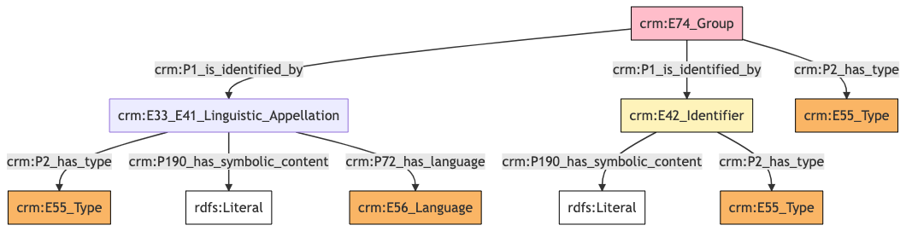
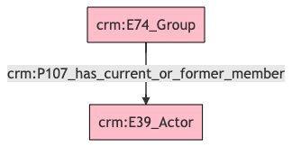
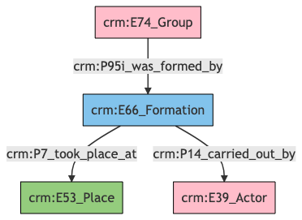
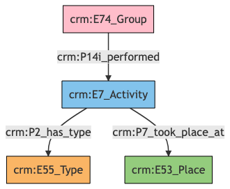
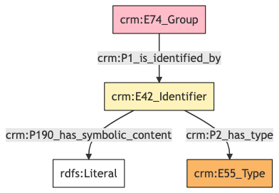
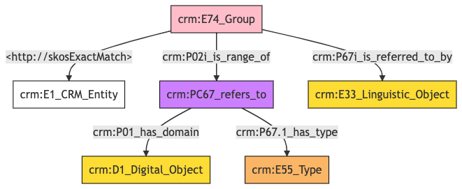

##**Group**##

**Author:** Denitsa Nenova, George Bruseker

**Version:** 1.0

The *Group* reference data model provides a list of standard descriptors (fields) that are typically present in the description of a *Group* or institution in cultural heritage data systems. The intention of this reference model is to provide a consolidated, high-level formal structure comprising the most commonly reused descriptors for a *Group*.

| | Name| URI | 
|-|-----|-----|
|Root Ontology Node|E74 Group |https://cidoc-crm.org/Entity/E74-Group/version-7.1.1 |
|Type Differentiator|N/A|N/A|

**Model Sections Description**

|Information Category | Information Collections | Description | 
|---------------------|-------------------------|-------------|
|Names and Classifications    |Names/Alternative Names/Identifiers/Type|   The researcher can document various names and classification regarding the *Group*.|
|Existence    |Formation|    The researcher can document the events related to the formation of the *Group*.|
|Parthood   |Members|    The researcher can document members of the *Group*.|
|Activities | Professional Activities|    The researcher can document information about the the professional activities of the *Group*.|
|Location |Contact Details|    The researcher can document relevant addresses and other contact information associated with the *Group*.|
|Description |   Description  |  The researcher can document various free-text descriptions of the *Group*.|
|Documentation    |Digital Resource|The researcher can document various weblinks and images related to the *Group*.|


## Group **Names and Classifications**

The attribution of names and types to things, including *Groups*, is a basic human activity. The disambiguation of *Groups* is aided by the understanding of the various names and identifiers that have been given to a *Group* at different moments in time. Moreover, classifications such as *Group* type and legal status can help in identifying and studying *Groups* over time.

| Filed ID    | Name                          | Description | Data Type | CRM Path |
| ----------- | ------------------------------|-------------|-----------|----------|
|LAF.6 |   Organization Name|    This field is used to record the string value of the name attributed to the documented *Group*.|    String  |  ->p1->E33_E41[4_1]->p190->rdf:literal|
|LAF.5  |  Name Type |   This field is used to record the type of the name attributed to the documented *Group*. |   Concept  |  ->p1->E33_41[4_1]->p2->E55[5_1]|
|LAF.7 |   Name Language  |  This field is used to record the language of the name attributed to the documented *Group*.  |  Concept   | ->p1->E33_E41[4_1]->p72->E56[7_1]|
|LAF.9 |   Organization ID Type  |  This field is used to record the type of the identifier attributed to the documented *Group*.  |  Concept   | ->p1->E42[8_1]->p2->E55[9_1]|
|LAF.10  |  Organization ID |   This field is used to record an identifier attributed to the documented *Group*. |   String   | ->p1->E42[8_1]->p190->rdf:literal|
|LAF.11  |  Organization Type   | This field is used to record the formal type of the documented *Group*.  |  Concept  |  ->p2->E55[11_1]|

### - Group Names and Classifications **Ontology Graph**


### - Group Names and Classifications **RDF**

```
@prefix crm: <http://www.cidoc-crm.org/cidoc-crm/> .
@prefix rdfs: <http://www.w3.org/2000/01/rdf-schema#> .

<https://pma.us/models/group/E74> a crm:E74_Group ;
    crm:P1_is_identified_by <https://linked.art/example/conceptual_object/4_1>,
        <https://linked.art/example/conceptual_object/8_1> ;
    crm:P2_has_type <https://linked.art/example/type/11_1> .

<http://vocab.getty.edu/page/aat/300404670> a crm:E55_Type ;
    rdfs:label "preferred terms" .

<https://linked.art/example/conceptual_object/4_1> a crm:E33_E41_Linguistic_Appellation ;
    crm:P190_has_symbolic_content "Name_string_value" ;
    crm:P2_has_type <http://vocab.getty.edu/page/aat/300404670> ;
    crm:P72_has_language <https://linked.art/example/type/7_1> .

<https://linked.art/example/conceptual_object/8_1> a crm:E42_Identifier ;
    crm:P190_has_symbolic_content "Identifier_value_content" ;
    crm:P2_has_type <https://linked.art/example/identifier/9_1> .

<https://linked.art/example/identifier/9_1> a crm:E55_Type .

<https://linked.art/example/type/11_1> a crm:E55_Type .

<https://linked.art/example/type/7_1> a crm:E56_Language .


                
```

### - Group Names and Classifications **JSON-LD**

```
{
  "@context": "https://linked.art/ns/v1/linked-art.json",
  "@graph": [
    {
      "id": "https://linked.art/example/identifier/9_1",
      "type": "Type"
    },
    {
      "_label": "preferred terms",
      "id": "http://vocab.getty.edu/page/aat/300404670",
      "type": "Type"
    },
    {
      "classified_as": [
        "https://linked.art/example/identifier/9_1"
      ],
      "content": "Identifier_value_content",
      "id": "https://linked.art/example/conceptual_object/8_1",
      "type": "Identifier"
    },
    {
      "classified_as": [
        "http://vocab.getty.edu/page/aat/300404670"
      ],
      "content": "Name_string_value",
      "id": "https://linked.art/example/conceptual_object/4_1",
      "language": [
        "https://linked.art/example/type/7_1"
      ],
      "type": "Name"
    },
    {
      "id": "https://linked.art/example/type/11_1",
      "type": "Type"
    },
    {
      "classified_as": [
        "https://linked.art/example/type/11_1"
      ],
      "id": "https://pma.us/models/group/E74",
      "identified_by": [
        "https://linked.art/example/conceptual_object/4_1",
        "https://linked.art/example/conceptual_object/8_1"
      ],
      "type": "Group"
    },
    {
      "id": "https://linked.art/example/type/7_1",
      "type": "Language"
    }
  ]
}
                
```
## Group **Parthood**
*Groups* often exist in complex internal structuration with relations of subsumption towards sub-parts of the *Group*. This information category gathers together the basic descriptors typically deployed to this end.

| Filed ID    | Name                          | Description | Data Type | CRM Path |
| ----------- | ------------------------------|-------------|-----------|----------|
|LAF.18  |  Members |   This field is used to link the documented *Group* to an instance of person or *Group* which is a member of it.|    Reference Model  [Person]|  ->p107->E21[18_1]|

### - Group Parthood **Ontology Graph**


### - Group Parthood **RDF**

```
@prefix crm: <http://www.cidoc-crm.org/cidoc-crm/> .

<https://pma.us/models/group/E74> a crm:E74_Group ;
    crm:P107_has_current_or_former_member <https://linked.art/example/actor/18_1> .

<https://linked.art/example/actor/18_1> a crm:E39_Actor .


                

```


### - Group Parthood **JSON-LD**

```
{
  "@context": "https://linked.art/ns/v1/linked-art.json",
  "@graph": [
    {
      "crm:P107_has_current_or_former_member": {
        "id": "https://linked.art/example/actor/18_1"
      },
      "id": "https://pma.us/models/group/E74",
      "type": "Group"
    },
    {
      "id": "https://linked.art/example/actor/18_1",
      "type": "Actor"
    }
  ]
}
                
```

## Group **Existence**
Of essential importance in identifying and tracking *Groups* is to know when they came into existence as such. For this reason, we have clustered descriptors relevant to such information into a common ‘existence’ category tracking the formation of a *Group*. These are described in the table below.

| Filed ID    | Name                          | Description | Data Type | CRM Path |
| ----------- | ------------------------------|-------------|-----------|----------|
|LAF.142 |   Organization Formed By  |  This field is used to link the documented group formation activity to an actor responsible for carrying it out. |   Reference Model  [Person/Group] | ->P95i->E66[139_1]->P14->E39[142_1]|
|LAF.139 |   Formation Place |   This field is used to link the documented group formation activity to a location at which it was carried out.  |  Reference Model [Place] |  ->P95i->E66[139_1]->P7->E53[139_2]|


### - Group Existence **Ontology Graph**


### - Group Existence **RDF**

```
@prefix crm: <http://www.cidoc-crm.org/cidoc-crm/> .

<https://pma.us/models/group/E74> a crm:E74_Group ;
    crm:P95i_was_formed_by <https://linked.art/example/event/139_1> .

<https://linked.art/example/actor/142_1> a crm:E39_Actor .

<https://linked.art/example/event/139_1> a crm:E66_Formation ;
    crm:P14_carried_out_by <https://linked.art/example/actor/142_1> ;
    crm:P7_took_place_at <https://linked.art/example/place/139_2> .

<https://linked.art/example/place/139_2> a crm:E53_Place .


                
```


### - Group Existence **JSON-LD**

```
{
  "@context": "https://linked.art/ns/v1/linked-art.json",
  "@graph": [
    {
      "formed_by": "https://linked.art/example/event/139_1",
      "id": "https://pma.us/models/group/E74",
      "type": "Group"
    },
    {
      "carried_out_by": [
        "https://linked.art/example/actor/142_1"
      ],
      "id": "https://linked.art/example/event/139_1",
      "took_place_at": [
        "https://linked.art/example/place/139_2"
      ],
      "type": "Formation"
    },
    {
      "id": "https://linked.art/example/place/139_2",
      "type": "Place"
    },
    {
      "id": "https://linked.art/example/actor/142_1",
      "type": "Actor"
    }
  ]
}
                
```


## Group **Activities**

This category brings together documentary evidence with regards to the main professional activities subject to the documented *Group*. 

| Filed ID    | Name                          | Description | Data Type | CRM Path |
| ----------- | ------------------------------|-------------|-----------|----------|
|LAF.134 |   Main Activity  |  This field is used to record the formal type of the documented *Group*'s professional activity.   | Concept   | ->P14i->E7[126_1]->P2->E55[134_1]|
|LAF.126  |  Current Location  |  This field is used to link the documented *Group*'s professional activity to a location at which it was carried out.   | Reference Model  [Place] |  ->P14i->E7[126_1]->P7->E53[126_2]|

### - Group Activities **Ontology Graph**


### - Group Activities **RDF**

```
@prefix crm: <http://www.cidoc-crm.org/cidoc-crm/> .

<https://pma.us/models/group/E74> a crm:E74_Group ;
    crm:P14i_performed <https://linked.art/example/event/126_1> .

<https://linked.art/example/event/126_1> a crm:E7_Activity ;
    crm:P2_has_type <https://linked.art/example/type/134_1> ;
    crm:P7_took_place_at <https://linked.art/example/place/126_2> .

<https://linked.art/example/place/126_2> a crm:E53_Place .

<https://linked.art/example/type/134_1> a crm:E55_Type .
```

 ### - Group Activities **JSON-LD**

```
{
  "@context": "https://linked.art/ns/v1/linked-art.json",
  "@graph": [
    {
      "id": "https://linked.art/example/place/126_2",
      "type": "Place"
    },
    {
      "carried_out": [
        "https://linked.art/example/event/126_1"
      ],
      "id": "https://pma.us/models/group/E74",
      "type": "Group"
    },
    {
      "classified_as": [
        "https://linked.art/example/type/134_1"
      ],
      "id": "https://linked.art/example/event/126_1",
      "took_place_at": [
        "https://linked.art/example/place/126_2"
      ],
      "type": "Activity"
    },
    {
      "id": "https://linked.art/example/type/134_1",
      "type": "Type"
    }
  ]
}
                
```               

## Group **Location**

The documentation of location aids in understanding where a *Group* is seated as well as in understanding how they are dispersed geographically. This information category gathers together relevant descriptors for this task.

| Filed ID    | Name                          | Description | Data Type | CRM Path |
| ----------- | ------------------------------|-------------|-----------|----------|
|LAF.172  |  Current Address  |  This field is used to link the documented *Group* to a place at which they have been resident. |   Reference Model  [Place] |  ->P74->E53[172_1]|
|LAF.169  |  Contact Point Type  |  This field is used to record the type of the contact Point attributed to the documented *Group*. |   Concept   | ->P1->E42[168_1]->P2->E55[169_1]|
|LAF.170 |   Contact Details  |  This field is used to record a contact Point attributed to the documented *Group*.  |  String   | ->P1->E42[168_1]->P190->rdf:literal|

### - Group Location **Ontology Graph**


### - Group Location **RDF**

```
@prefix crm: <http://www.cidoc-crm.org/cidoc-crm/> .

<https://pma.us/models/group/E74> a crm:E74_Group ;
    crm:P1_is_identified_by <https://linked.art/example/conceptual_object/168_1> .

<https://linked.art/example/conceptual_object/168_1> a crm:E42_Identifier ;
    crm:P190_has_symbolic_content "Identifier_value_content" ;
    crm:P2_has_type <https://linked.art/example/type/169_1> .

<https://linked.art/example/type/169_1> a crm:E55_Type .


                
```

### - Group Location **JSON-LD**

```
{
  "@context": "https://linked.art/ns/v1/linked-art.json",
  "@graph": [
    {
      "id": "https://pma.us/models/group/E74",
      "identified_by": [
        "https://linked.art/example/conceptual_object/168_1"
      ],
      "type": "Group"
    },
    {
      "id": "https://linked.art/example/type/169_1",
      "type": "Type"
    },
    {
      "classified_as": [
        "https://linked.art/example/type/169_1"
      ],
      "content": "Identifier_value_content",
      "id": "https://linked.art/example/conceptual_object/168_1",
      "type": "Identifier"
    }
  ]
}
                
```

## Group **Documentation**

This information category unites referential information about the documented *Group*.


| Filed ID    | Name                          | Description | Data Type | CRM Path |
| ----------- | ------------------------------|-------------|-----------|----------|
|LAF.37  |  Weblink  |  This field is used to document a URI which is meant to indicate an equivalence between the documented *Group* and a resolvable, structured reference resource that stands as a document for this self same entity.  |  Class  |  ->skos:ExactMatch->E1[37_1]|
|LAF.173  |  Reference  |  This field is used to link the documented *Group* to an instance of textual work in which it is documented or mentioned.  |  Reference Model  [Textual Work]|  ->P67i->E33[173_1]|
|PMAF.83  |  Digital Object  |  This field is used to link to an instance of digital resource which serves as a digital reference document for the documented *Group*.  |  Reference Model [Digital Object] |   ->P02i->PC67[A83_1]->P01->D1[A83_2]|
|PMAF.84  |  Digital Object Type  |  This field is used to link to a type record which indicates the kind of reference supported by the digital resource that serves as a reference for the documented *Group*.  |  Concept   | ->P02i->PC67[A83_1]->P67.1->E55[A84_1]|

### - Group Documentation **Ontology Graph**


### - Group Documentation **RDF**

```
@prefix crm: <http://www.cidoc-crm.org/cidoc-crm/> .
@prefix skos: <http://skos> .

<https://pma.us/models/group/E74> a crm:E74_Group ;
    skos:ExactMatch <https://linked.art/example/entity/37_1> ;
    crm:P02i_is_range_of <https://linked.art/example/reified_property/A83_1> ;
    crm:P67i_is_referred_to_by <https://linked.art/example/conceptual_object/173_1> .

<https://linked.art/example/conceptual_object/173_1> a crm:E33_Linguistic_Object .

<https://linked.art/example/conceptual_object/A83_2> a crm:D1_Digital_Object .

<https://linked.art/example/conceptual_object/A84_1> a crm:E55_Type .

<https://linked.art/example/entity/37_1> a crm:E1_CRM_Entity .

<https://linked.art/example/reified_property/A83_1> a crm:PC67_refers_to ;
    crm:P01_has_domain <https://linked.art/example/conceptual_object/A83_2> ;
    crm:P67.1_has_type <https://linked.art/example/conceptual_object/A84_1> .


                
```

### - Group Documentation **JSON-LD**

```
{
  "@context": "https://linked.art/ns/v1/linked-art.json",
  "@graph": [
    {
      "id": "https://linked.art/example/conceptual_object/A83_2",
      "type": "crm:D1_Digital_Object"
    },
    {
      "crm:P01_has_domain": {
        "id": "https://linked.art/example/conceptual_object/A83_2"
      },
      "crm:P67.1_has_type": {
        "id": "https://linked.art/example/conceptual_object/A84_1"
      },
      "id": "https://linked.art/example/reified_property/A83_1",
      "type": "crm:PC67_refers_to"
    },
    {
      "id": "https://linked.art/example/conceptual_object/A84_1",
      "type": "Type"
    },
    {
      "crm:P02i_is_range_of": {
        "id": "https://linked.art/example/reified_property/A83_1"
      },
      "http://skosExactMatch": {
        "id": "https://linked.art/example/entity/37_1"
      },
      "id": "https://pma.us/models/group/E74",
      "referred_to_by": [
        "https://linked.art/example/conceptual_object/173_1"
      ],
      "type": "Group"
    },
    {
      "id": "https://linked.art/example/entity/37_1",
      "type": "CRMEntity"
    },
    {
      "id": "https://linked.art/example/conceptual_object/173_1",
      "type": "LinguisticObject"
    }
  ]
}
                
```
