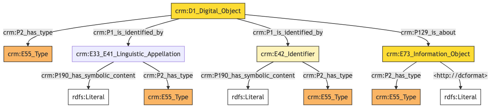
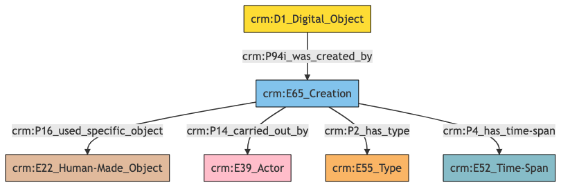

**Digital Object**

**Author:** Denitsa Nenova, George Bruseker

**Version:** 1.0

The *Digital Object* reference data model provides a list of standard fields that are typically present in the general description of a *Digital Object* in a cultural heritage data system. A *Digital Object* is meant in the sense of a digitally encoded information object represented as bit sequences that have been encoded with a particular format and can be digitally decoded and represented to an end user of a digital information system. *Digital Objects* are often stored as reference or documentation objects relative to cultural heritage items such as textual descriptions stored as PDFs, documentary images, 3D representations and so on. *Digital Objects* can also form cultural heritage objects in their own right, though this model does not aim to represent this potential aspect of the *Digital Object*. Because of the choice to model, the *Digital Object* in its role as a secondary documentary resource, the reference data model has been kept as light as possible.


| | Name| URI | 
|-|-----|-----|
|Root Ontology Node|D1 Digital Object|https://cidoc-crm.org/Entity/D1-Digital Object/version-7.1.1 |
|Type Differentiator|N/A|N/A|

**Model Sections Description**

|Information Category | Information Collections | Description | 
|---------------------|-------------------------|-------------|
|Names and Classifications    |Names/Alternative Names/Identifiers/Type|    The researcher can document various names and classification regarding the *Digital Object*.|
|Existence |  Creation  | The researcher can document the cretaion of the *Digital Object*.|

## Digital Object **Names and Classifications**

The attribution of identifiers, names and types to a *Digital Object*, as with other entities, is a basic human activity. It is crucial to document these aspects in order to be able to store and retrieve the correct *Digital Object*.

| Filed ID    | Name                          | Description | Data Type | CRM Path |
| ----------- | ------------------------------|-------------|-----------|----------|
|LAF.10  |  Digital Object Identifier |   This field is used to record an identifier attributed to the documented *Digital Object*.  |  String  |  ->p1->E42[8_1]->p190->rdf:literal|
|LAF.9  |  Digital Object Identifier type |   This field is used to record the type of the identifier attributed to the documented *Digital Object*.  |  Concept  |  ->p1->E42[8_1]->p2->E55[9_1]|
|LAF.6  |  Digital Object Name  |   This field is used to record the string value of the name attributed to the documented *Digital Object*.  |  String   | ->p1->E33_E41[4_1]->p190->rdf:literal|
|LAF.5  |  Digital Object Name type |   This field is used to record the type of the name attributed to the documented *Digital Object*.  |  Concept  |  ->p1->E33_41[4_1]->p2->E55[5_1]|
|LAF.11 |   Digital Object Type  |  This field is used to record the formal type of the documented *Digital Object*.  |  Concept |   ->p2->E55[11_1]|
|LAF.114 |   Digital Object File Type |   This field is used to record the formal file type of the documented *Digital Object*. |   Concept |   ->p129->E73[112_1]->p2->E55[114_1]|
|LAF.115  |  Digital Object File Format  |  This field is used to record the file format of the documented *Digital Object* . |   String   | ->p129->E73[112_1]->dc:format->rdf:literal|


### - Digital Object Names and Classifications **Ontology Graph**


### - Digital Object Names and Classifications **RDF**

```
@prefix crm: <http://www.cidoc-crm.org/cidoc-crm/> .
@prefix dc: <http://dc> .
@prefix rdfs: <http://www.w3.org/2000/01/rdf-schema#> .

<https://pma.us/models/digital_resources/D1> a crm:D1_Digital_Object ;
    crm:P129_is_about <https://linked.art/example/conceptual_object/112_1> ;
    crm:P1_is_identified_by <https://linked.art/example/conceptual_object/4_1>,
        <https://linked.art/example/conceptual_object/8_1> ;
    crm:P2_has_type <https://linked.art/example/type/11_1> .

<http://vocab.getty.edu/page/aat/300404670> a crm:E55_Type ;
    rdfs:label "preferred terms" .

<https://linked.art/example/conceptual_object/112_1> a crm:E73_Information_Object ;
    dc:format "format_value" ;
    crm:P2_has_type <https://linked.art/example/type/114_1> .

<https://linked.art/example/conceptual_object/4_1> a crm:E33_E41_Linguistic_Appellation ;
    crm:P190_has_symbolic_content "Name_string_value" ;
    crm:P2_has_type <http://vocab.getty.edu/page/aat/300404670> .

<https://linked.art/example/conceptual_object/8_1> a crm:E42_Identifier ;
    crm:P190_has_symbolic_content "Identifier_value_content" ;
    crm:P2_has_type <https://linked.art/example/identifier/9_1> .

<https://linked.art/example/identifier/9_1> a crm:E55_Type .

<https://linked.art/example/type/114_1> a crm:E55_Type .

<https://linked.art/example/type/11_1> a crm:E55_Type .


                


                
```

### - Digital Object Names and Classifications **JSON-LD**

```
{
  "@context": "https://linked.art/ns/v1/linked-art.json",
  "@graph": [
    {
      "classified_as": [
        "http://vocab.getty.edu/page/aat/300404670"
      ],
      "content": "Name_string_value",
      "id": "https://linked.art/example/conceptual_object/4_1",
      "type": "Name"
    },
    {
      "classified_as": [
        "https://linked.art/example/identifier/9_1"
      ],
      "content": "Identifier_value_content",
      "id": "https://linked.art/example/conceptual_object/8_1",
      "type": "Identifier"
    },
    {
      "_label": "preferred terms",
      "id": "http://vocab.getty.edu/page/aat/300404670",
      "type": "Type"
    },
    {
      "id": "https://linked.art/example/identifier/9_1",
      "type": "Type"
    },
    {
      "about": [
        "https://linked.art/example/conceptual_object/112_1"
      ],
      "classified_as": [
        "https://linked.art/example/type/11_1"
      ],
      "id": "https://pma.us/models/digital_resources/D1",
      "identified_by": [
        "https://linked.art/example/conceptual_object/8_1",
        "https://linked.art/example/conceptual_object/4_1"
      ],
      "type": "crm:D1_Digital_Object"
    },
    {
      "id": "https://linked.art/example/type/11_1",
      "type": "Type"
    },
    {
      "classified_as": [
        "https://linked.art/example/type/114_1"
      ],
      "http://dcformat": "format_value",
      "id": "https://linked.art/example/conceptual_object/112_1",
      "type": "InformationObject"
    },
    {
      "id": "https://linked.art/example/type/114_1",
      "type": "Type"
    }
  ]
}
                
```

## Digital Object **Existence**

Of essential import in identifying and tracking a *Digital Object* are its creation and modification information. The model presented allows the tracking of the machine event which originally created the *Digital Object* as well as subsequent machine events of a modifying character of which it was the output. The destruction of the *Digital Object* is not modelled as being irrelevant to the use scope of integrated CH reference documentation.

| Filed ID    | Name                          | Description | Data Type | CRM Path |
| ----------- | ------------------------------|-------------|-----------|----------|
|LAF.86 |   Digital Object Created by |   This field is used to link the documented *Digital Object* creation activity to an actor responsible for carrying it out.   | Reference Model [Person/Group] |  ->P94i->E65[71_1]->P14->E39[86_1]|
|LAF.89 |   Digital Object Created using |   This field is used to link the documented *Digital Object* creation activity to an instance of physical object used in the exercise of this activity in a manner consequential to its outcome.   | Reference Model [Object] |  ->P94i->E65[71_1]->P16->E22[89_1]|
|LAF.91  |  Digital Object Creation type |   This field is used to record the formal type of the documented *Digital Object* creation activity.   | Concept |   ->P94i->E65[71_1]->P2->E55[91_1]|
|LAF.90 |   Digital Object Creation time  |  This field is used to link the documented *Digital Object* creation activity to an instance of time-span recording the temporal extent of the activity.  |  Collection  [Timespan] | ->P94i->E65[71_1]->P4->E52[90_1]|


### - Digital Object Existence **Ontology Graph**


### - Digital Object Existence **RDF**

```
@prefix crm: <http://www.cidoc-crm.org/cidoc-crm/> .

<https://pma.us/models/digital_resources/D1> a crm:D1_Digital_Object ;
    crm:P94i_was_created_by <https://linked.art/example/event/71_1> .

<https://linked.art/example/actor/86_1> a crm:E39_Actor .

<https://linked.art/example/event/71_1> a crm:E65_Creation ;
    crm:P14_carried_out_by <https://linked.art/example/actor/86_1> ;
    crm:P16_used_specific_object <https://linked.art/example/physical_object/89_1> ;
    crm:P2_has_type <https://linked.art/example/type/91_1> ;
    crm:P4_has_time-span <https://linked.art/example/time_span/90_1> .

<https://linked.art/example/physical_object/89_1> a crm:E22_Human-Made_Object .

<https://linked.art/example/time_span/90_1> a crm:E52_Time-Span .

<https://linked.art/example/type/91_1> a crm:E55_Type .


                

```

### - Digital Object Existence **JSON-LD**

```
{
  "@context": "https://linked.art/ns/v1/linked-art.json",
  "@graph": [
    {
      "created_by": "https://linked.art/example/event/71_1",
      "id": "https://pma.us/models/digital_resources/D1",
      "type": "crm:D1_Digital_Object"
    },
    {
      "id": "https://linked.art/example/actor/86_1",
      "type": "Actor"
    },
    {
      "id": "https://linked.art/example/time_span/90_1",
      "type": "TimeSpan"
    },
    {
      "carried_out_by": [
        "https://linked.art/example/actor/86_1"
      ],
      "classified_as": [
        "https://linked.art/example/type/91_1"
      ],
      "id": "https://linked.art/example/event/71_1",
      "timespan": "https://linked.art/example/time_span/90_1",
      "type": "Creation",
      "used_specific_object": [
        "https://linked.art/example/physical_object/89_1"
      ]
    },
    {
      "id": "https://linked.art/example/physical_object/89_1",
      "type": "HumanMadeObject"
    },
    {
      "id": "https://linked.art/example/type/91_1",
      "type": "Type"
    }
  ]
}
                
                
```
